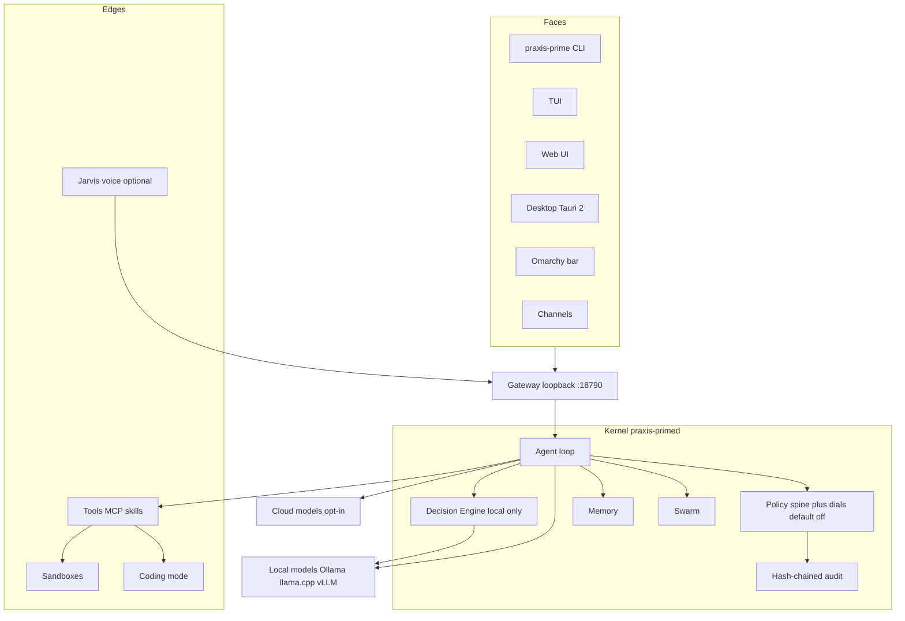

# Praxis Prime

[](https://github.com/smfworks/praxis-prime)
[](https://github.com/smfworks/praxis-prime/actions/workflows/ci.yml)
[](https://www.python.org/downloads/)
[](LICENSE)

**Status: pre-alpha.** A local agent loop is running: terminal chat, a model router, tools, a session audit log, coding mode (`praxis-prime code`), a loopback daemon (`praxis-primed`) with a WebSocket and HTTP gateway, and a local Decision Engine (`praxis-prime decide`, `POST /v1/decide`). When profiles exist, the daemon supervises one worker process per profile (memory, skills, routines, and approvals stay in that profile's data root). Telegram can chat and approve, and a bound chat only decides that person's approvals. The loopback daemon also serves the local web app: sign in, chat, and approve on `http://127.0.0.1:18790/`. Swarm, voice, and the desktop shell are still stubs. Compliance dials, and the decision pre-screener, still default to off.

Praxis Prime is an open-source, local-first autonomous AI agent for Linux, by [SMF Works](https://github.com/smfworks) (Michael Gannotti). It is the flagship evolution of [SMF Praxis](https://github.com/smfworks/smf-praxis): a governed agent that can read, research, and draft on its own, and that stops for a human when an action has consequences. Sending, deleting, spending, sharing, and publishing stay behind that approval spine. Regulatory overlays are optional dials, and they ship **off**.

It is aimed at Ubuntu 22.04 and 24.04, and at [Omarchy](https://github.com/basecamp/omarchy) (Arch plus Hyprland). No model provider is selected for you. Choose one with `praxis-prime setup` or the web wizard: this computer, a host on your network, or a cloud provider. There is no hosted decision service.

The design takes patterns, and later may take MIT-licensed code, from [Hermes Agent](https://github.com/NousResearch/hermes-agent) (Nous Research), [OpenClaw](https://github.com/openclaw/openclaw) (OpenClaw Foundation, Peter Steinberger, and contributors), SMF Praxis, and [SMF Swarm 2.0](https://github.com/smfworks/smf-swarm-2.0). SMF Works does not own Hermes, OpenClaw, or Omarchy. See [NOTICE](NOTICE) and [THIRD_PARTY.md](THIRD_PARTY.md).

## What works today

From a checkout, with Python 3.12:

```bash
python3 -m venv .venv
source .venv/bin/activate
python -m pip install -e ".[dev]"

praxis-prime --version
pprime --version
praxis-primed --version

praxis-prime doctor
praxis-prime config
praxis-prime chat
praxis-prime ask "summarize the files in this directory"
```

`chat` is an interactive session. Replies stream. Tool calls show up as a plan → check → act timeline. When a tool needs approval the prompt is `y` (once), `n` (deny), or `a` (always this exact action for the session). `/help`, `/model`, `/model ollama:qwen3:8b`, and `/clear` work in the session. Ctrl-C cancels the current turn. Ctrl-D exits.

`ask` runs one turn and prints the answer on stdout. The timeline goes to stderr.

A fresh config has no provider. Chat refuses with "No model provider is configured" until you choose one and it passes a live test. An API key in the environment, a running local server, or a pack author's model hint does not select a provider. API keys are stored in the secrets file or the environment, never in config entries:

```bash
# optional cloud or local OpenAI-compatible servers
export PRAXIS_PRIME_MODEL=ollama:qwen3:8b
export PRAXIS_PRIME_OLLAMA_HOST=http://127.0.0.1:11434
export PRAXIS_PRIME_OPENAI_COMPATIBLE_BASE_URL=http://127.0.0.1:8080/v1   # llama.cpp or vLLM
export PRAXIS_PRIME_FALLBACK_MODELS=openai-compatible:local
# export PRAXIS_PRIME_OPENAI_API_KEY=...        # or OPENAI_API_KEY
# export PRAXIS_PRIME_ANTHROPIC_API_KEY=...     # or ANTHROPIC_API_KEY
# export PRAXIS_PRIME_XAI_API_KEY=...           # or XAI_API_KEY
```

`shell` runs inside bubblewrap when `bwrap` is on `PATH` (no network). The workspace is mounted read-only unless the command was approved as a write, or a coding session was approved for its own worktree. Commands that are not on the read-only allowlist (`ls`, `cat` in the workspace, `git status` / `diff` / `log`) ask first, including inside the sandbox. Without bubblewrap, shell commands are refused once account data exists. On a fresh install with no account data, every command asks first and then runs on the host. A failed sandbox is not rerun on the host. Tool output is wrapped as untrusted data. Sessions and the audit log are SQLite at `$XDG_DATA_HOME/praxis-prime/prime.db` (or `~/.local/share/praxis-prime/prime.db`).

A longer usage note is in [docs/USAGE.md](docs/USAGE.md).

`doctor` exits 0 unless Python is older than 3.12. That is the only failure. It also reports:

- OS family: Ubuntu, Arch, or Omarchy (anything else is a warning)
- Display session: Wayland or X11 (a headless machine is a warning)
- The configured provider (unset or unverified is a warning; a verified provider is ok)
- Local servers it can see (information only; a detection does not select one)
- Whether bubblewrap and the browser driver are present

`config` writes the XDG default config. It does not overwrite an existing file unless you pass `--force`.

```text
$XDG_CONFIG_HOME/praxis-prime/config.toml
$XDG_CONFIG_HOME/praxis-prime/policy/profile.toml
```

With `XDG_CONFIG_HOME` unset, those paths are under `~/.config/praxis-prime/`. Every compliance dial in that file is `off`, and `policy/profile.toml` lists no active dials. The baseline approval spine is not a dial. Jarvis is disabled. The sandbox network default is `off`. The gateway address in the file is loopback `127.0.0.1:18790`. `praxis-primed` binds that address and refuses any other host.

`praxis-prime daemon start` runs the daemon in the background. `chat` and `ask` attach to it when it is healthy, and run in-process when it is not (`--local` always stays in-process). `praxis-prime service install` enables the systemd user unit on Ubuntu and on Arch/Omarchy. Setup for the service and the Telegram bot is in [docs/USAGE.md](docs/USAGE.md).

## Feature overview

| Area | Plan | In this tree |
|---|---|---|
| Governed agent loop | Perceive, plan, govern, act, reflect. Hermes prompt-cache invariants. OpenClaw queue modes. | Plan → check → act, streaming, steer/cancel, approval spine. [§5](docs/ARCHITECTURE.md) |
| Local Decision Engine | Our own cascade: rules, ONNX classifiers, calibrated small-LLM judges, then a jury. Wire shape similar to a public decision API. No hosted TypeSafe service. | Local cascade is running: rules, a keyword classifier, one local judge, a jury, then a larger local model or a human. `praxis-prime decide` and `POST /v1/decide`. ONNX weights are not loaded. No hosted decision service. [§7](docs/ARCHITECTURE.md), [DECISION-ENGINE.md](docs/DECISION-ENGINE.md) |
| Compliance dials | HIPAA, FERPA, COPPA, GDPR, 13 Praxis state packs, a new North Carolina pack, then SOC 2, EU AI Act, CCPA, PCI, NIST AI RMF, and ISO 42001. Off, monitor, or enforce. **Default off.** | Catalog, bundled packs, and evaluation are in. Off adds nothing. Monitor writes an audit warning and lets the action run. Enforce may only tighten a verdict (ask, deny, redact, pin providers, or deny egress). A fresh config stays off, so those rules do not run. The per-dial hook objects are still placeholders. [§17](docs/ARCHITECTURE.md), [COMPLIANCE.md](docs/COMPLIANCE.md) |
| Agent swarms | Workers, a blackboard, and the Swarm 2.0 personas as jury lenses. | Package stub. [§15](docs/ARCHITECTURE.md) |
| Coding-agent mode | Worktrees, diffs, tests, and `AGENTS.md` / `CLAUDE.md` / `.cursor` rules. | `praxis-prime code` and `/code`: worktrees, instruction files, hooks, diff review. No embedding index yet. [§14](docs/ARCHITECTURE.md) |
| Gateway | One typed WebSocket protocol for CLI, TUI, web, desktop, channels, and nodes. Loopback only. | Loopback HTTP and WebSocket, token auth, Telegram channel, the local web app, and `praxis-prime tui` (`praxis_prime.tui`). [§4](docs/ARCHITECTURE.md) |
| Jarvis voice layer | Optional wake word, local STT/TTS, Home Assistant, desktop control. Separate user service, off by default. | Package stub. [§19](docs/ARCHITECTURE.md) |
| Desktop and web UI | One React SPA inside a Tauri 2 shell, also served by the daemon. | The SPA is served by the daemon from `ui/dist`. The Tauri shell is still a stub. [§21](docs/ARCHITECTURE.md) |
| Packaging | `.deb`, APT repo, AppImage, AUR, systemd user units, Omarchy bar plugin. | Local `.deb` (`packaging/deb/build-deb.sh`) and AUR `praxis-prime-git` PKGBUILD. Not published to APT or the AUR. User unit installs with `praxis-prime service install`. [§26](docs/ARCHITECTURE.md), [§27](docs/ARCHITECTURE.md) |

The full comparison with Hermes, OpenClaw, Praxis, Swarm 2.0, and the Jev reference column is in [docs/CAPABILITY-MATRIX.md](docs/CAPABILITY-MATRIX.md).

## Architecture



The blueprint's full diagram, process topology, and the reasoning behind each box are in [docs/ARCHITECTURE.md](docs/ARCHITECTURE.md). A single-page render is at [docs/architecture.html](docs/architecture.html).

Names used throughout: distribution `praxis-prime`, import package `praxis_prime`, CLI `praxis-prime` with alias `pprime`, daemon `praxis-primed`. The bare command `prime` is intentionally unused. It collides with other tools.

## Roadmap

Condensed from [ARCHITECTURE §29](docs/ARCHITECTURE.md) and [Blueprint Addendum A](docs/blueprint-addendum-2026-09.md). Dates are not scheduled. The phases are scope gates. The next build order inside them is M0–M8.

| # | Milestone | Phase |
|---|---|---|
| **M0** | Packs ship in the wheel. Legacy `pack.json` loader ignores `ollama-cloud` model pins and pack dashboard JavaScript. | MVP completion (v0.2–0.3) |
| **M1** | Web shell, accounts, and profiles. Loopback only. **M1a** accounts, roles, and profiles (merged). **M1b** passkeys + TOTP (local enrollment and sign-in on the loopback daemon). **M1c** per-profile workers and supervisor (in the tree; see [SECURITY.md](docs/SECURITY.md)). **M1d** SPA (sign-in, chat, approvals, profile picker, factors, read-only catalog). **M1e** OIDC sign-in (in the tree; see [SECURITY.md](docs/SECURITY.md)). | MVP completion (v0.2–0.3) |
| **M2** | First-run wizard (in the tree). No default provider. `praxis-prime setup` and the web wizard share one backend. | MVP completion (v0.2–0.3) |
| **M3** | Theme packages (in the tree). Eight built-ins pass WCAG 2.2 AA. High Contrast is AAA. System (Omarchy) applies only when a profile chooses it and the rendered file passes the same check. Authoring is [docs/THEME-AUTHORING.md](docs/THEME-AUTHORING.md). | MVP completion (v0.2–0.3) |
| **M4** | Local sandbox and agent computer: T1 bubblewrap (data-root mask and denylist) for shell, T2 rootless Podman for builds and the virtual desktop. | v0.5 |
| **M5a** / **M5b** | Ubuntu and Omarchy installers, then a WSL2 supported beta. | v0.5 |
| **M6** | Opt-in remote access and a PWA. Loopback stays the default. | v0.5 |
| **M7** | Tauri 2 desktop shell. | v0.6–v0.8 |
| **M8** | Microsoft 365 (Entra sign-in, Teams, Intune/winget). | v0.6–v0.8 |

| Phase | Product | Decision Engine | Dials |
|---|---|---|---|
| **MVP (v0.1–v0.3)** | M0–M3, then the rest of this row: daemon, gateway, CLI, TUI, web UI, an explicit provider choice (no default LLM), core tools, bubblewrap, MCP client, skills, memory, approval cards, audit chain, routines, coding mode, `praxis-prime migrate --from-praxis` (in the tree), `.deb` and AUR, Omarchy theme and keybind. | Rules, one local classifier tier, one local judge, `/v1/decide`. Escalate only. | Dial framework. NC data-privacy baseline. 13 state packs and regulated packs imported, monitor mode. |
| **v0.5** | M4–M6, then Omarchy bar plugin, more channels (Teams is M8), swarm runtime, auto mode, hooks, Podman, plugin SDK, Jarvis alpha, APT repo and AppImage. | Jury of judges, calibration, disagreement escalation. | Enforce HIPAA, FERPA/COPPA, GDPR, the 13 state packs, and NC. |
| **v0.6–v0.8** | M7 Tauri desktop. M8 Microsoft 365. | Stays on the v0.5 and v1.0 rows, after M3. | Enforce work stays on the v0.5 row. |
| **v1.0** | Host computer use, virtual desktop, microVM and remote sandboxes, background coding, MCP server, ACP, out-of-process plugins, signed releases, docs site. | Drift detection, per-pack calibrators, a published reliability report. | SOC 2, EU AI Act, CCPA, PCI, NIST AI RMF, ISO 42001, with evidence export. |

Dials produce technical controls and evidence. They are not legal certifications. Counsel review is required before any enforce mode is recommended to anyone else. See the risks in [ARCHITECTURE §30](docs/ARCHITECTURE.md).

## Install

**The package is not published.** There is no APT repository, no AUR submission, and no install script host. `get.smfworks.com` and `apt.smfworks.com` do not serve Praxis Prime. Do not run the commented commands in the "Published install" section.

You can build a local `.deb`, or use the Arch PKGBUILD, from this checkout. Those packages are not in the Ubuntu or Arch repositories. The maintainer address `maintainers@praxis-prime.invalid` does not receive mail.

### Ubuntu 24.04: build a local .deb

The build does not need root. Installing the `.deb` does.

```bash
packaging/deb/build-deb.sh --help
packaging/deb/build-deb.sh
sudo apt install ./dist/praxis-prime_0.1.0_amd64.deb
```

On x86_64 the file is `amd64` because the virtualenv under `/opt/praxis-prime` bundles compiled wheels (`cryptography`, `argon2-cffi`). It depends on the system interpreter used at build time (`python3.12` on Ubuntu 24.04) and on `bubblewrap`. `praxis-prime`, `pprime`, and `praxis-primed` land on `PATH`. The package installs `praxis-prime.service` and `praxis-prime-workers.slice` under `/usr/lib/systemd/user/` and does not enable them or linger. It does not ship pip. The optional Textual TUI is added afterwards with `ensurepip` (see [packaging/deb/README.md](packaging/deb/README.md)).

Details: [packaging/deb/README.md](packaging/deb/README.md).

### Omarchy / Arch: local PKGBUILD

`praxis-prime-git` is not submitted to the AUR. Do not `yay -S` it. `praxis-prime-bin` waits on a release tarball and is not implemented.

```bash
repo=$(git rev-parse --show-toplevel)
mkdir -p /tmp/praxis-prime-aur && cd /tmp/praxis-prime-aur
cp "$repo/packaging/aur/PKGBUILD" .
sed -i "s|git+https://github.com/smfworks/praxis-prime.git|git+file://${repo}|" PKGBUILD
makepkg -si
```

`makepkg` runs on Arch, not on Ubuntu. Details: [packaging/aur/README.md](packaging/aur/README.md).

`praxis-prime omarchy install` writes the theme template and the Super+Alt+A keybind, and asks before each change. `praxis-prime omarchy status` and `praxis-prime omarchy uninstall` cover that scope. The key launches the TUI until the desktop app exists. The Quickshell bar plugin, default-agent registration, and skill symlink are still future. Details are in [docs/USAGE.md](docs/USAGE.md) and [apps/omarchy](apps/omarchy).

### Published install (not available)

```bash
# Placeholder URL. get.smfworks.com is not a Praxis Prime installer.
# curl -fsSL https://get.smfworks.com/praxis-prime/install.sh | bash

# Placeholder APT repo. apt.smfworks.com does not serve this package.
# sudo apt update && sudo apt install praxis-prime praxis-prime-desktop
# systemctl --user enable --now praxis-prime.service

# Not in the AUR.
# yay -S praxis-prime-bin
# praxis-prime omarchy install
```

Planned later: `praxis-prime-desktop` (Tauri), `praxis-prime-voice`, `praxis-prime-packs`, an APT repository, and `praxis-prime-bin`. Unit files live under [packaging/systemd](packaging/systemd).

### From this git checkout (development)

```bash
python3 -m venv .venv
source .venv/bin/activate
python -m pip install -e ".[dev]"
# or, if you use uv:
# uv venv && uv pip install -e ".[dev]"
```

Development checks:

```bash
ruff check .
pytest
praxis-prime doctor
```

## Documentation

| Document | What it is |
|---|---|
| [docs/ARCHITECTURE.md](docs/ARCHITECTURE.md) | Source of truth for layout, names, and stack. §29 follows milestones M0–M8 |
| [docs/blueprint-addendum-2026-09.md](docs/blueprint-addendum-2026-09.md) | Addendum A (2026-09-30; sandbox decision revised 2026-10-02): themes, no default LLM, the local sandbox, any-device access, profiles, and the M0–M8 build order |
| [docs/CAPABILITY-MATRIX.md](docs/CAPABILITY-MATRIX.md) | Feature-by-feature plan against the source systems |
| [docs/SOURCE-NOTES.md](docs/SOURCE-NOTES.md) | Licenses, file paths, reuse plan, unverified items |
| [docs/architecture.html](docs/architecture.html) | Rendered blueprint (architecture, matrix, and notes) |
| [AGENTS.md](AGENTS.md) | Notes for coding agents working in this repo |
| [CONTRIBUTING.md](CONTRIBUTING.md) | How to build, test, and send a change |
| [SECURITY.md](SECURITY.md) | How to report a vulnerability |
| [CODE_OF_CONDUCT.md](CODE_OF_CONDUCT.md) | Community standards |
| [NOTICE](NOTICE), [THIRD_PARTY.md](THIRD_PARTY.md) | Attribution |

## Layout

```text
praxis-prime/
├─ packages/prime-core/praxis_prime/   # import package and CLI
├─ packages/prime-{cli,voice,desktopctl,sdk}/
├─ packs/{general,jurisdictions,regulated}/
├─ plugins/  ui/  apps/{desktop,omarchy}/
├─ protocol/  skills/  models/decide/  evals/
├─ packaging/{deb,aur,systemd,appimage,flatpak,apt-repo}/
├─ scripts/contrast_check.py          # WCAG check for the addendum palettes
└─ docs/
```

The kernel subpackages (`loop`, `gateway`, `decide`, `swarm`, and the rest) match [ARCHITECTURE §24](docs/ARCHITECTURE.md). Each one points at the blueprint section that will fill it in. Upstream trees are not vendored.

## Credits

Work reused or adapted from other people is listed in [CREDITS.md](CREDITS.md).
The local `.deb` and AUR packages bundle the locked PyPI runtime dependencies under each project's own license. Optional Textual is not included in those packages.

## License

MIT. Copyright (c) 2026 SMF Works. See [LICENSE](LICENSE).

Hermes Agent, OpenClaw, and Omarchy belong to their authors. SMF Works wrote SMF Praxis and SMF Swarm 2.0. The six public MIT vertical packs are not vendored here. `praxis-prime packs install` loads them as data. See [docs/PACKS-LEGACY.md](docs/PACKS-LEGACY.md).
