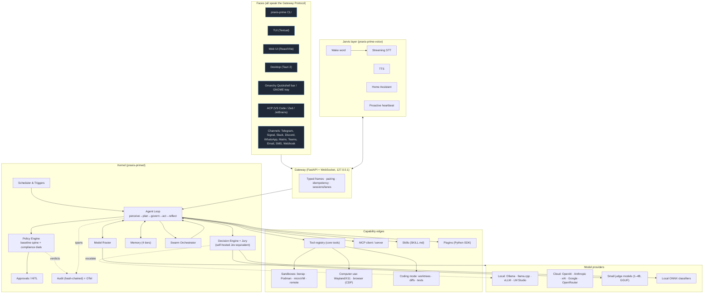
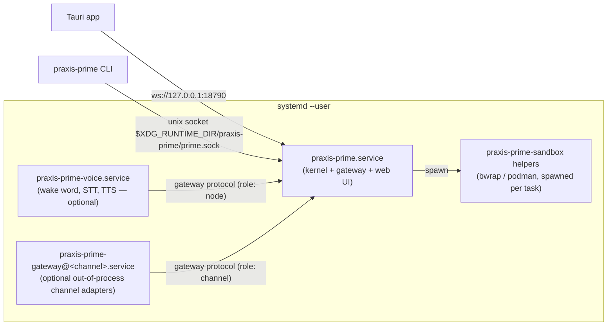
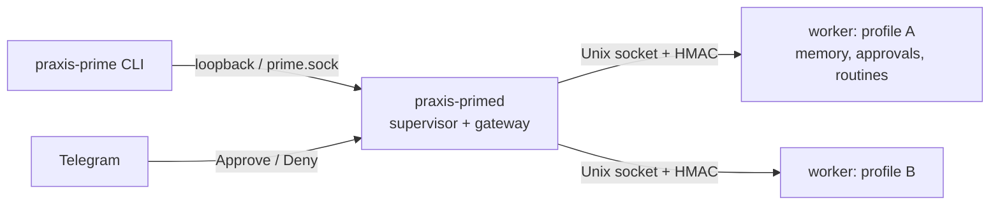
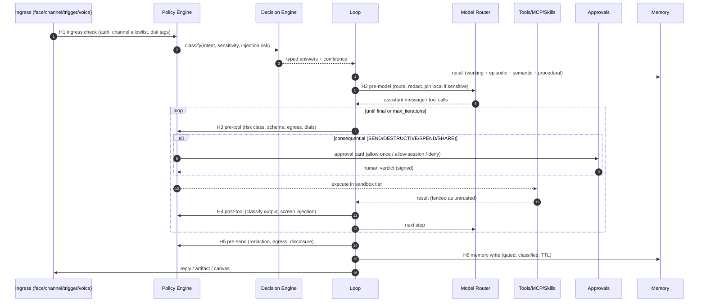
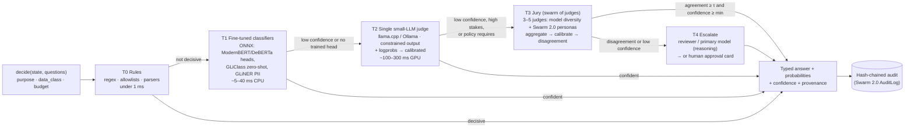
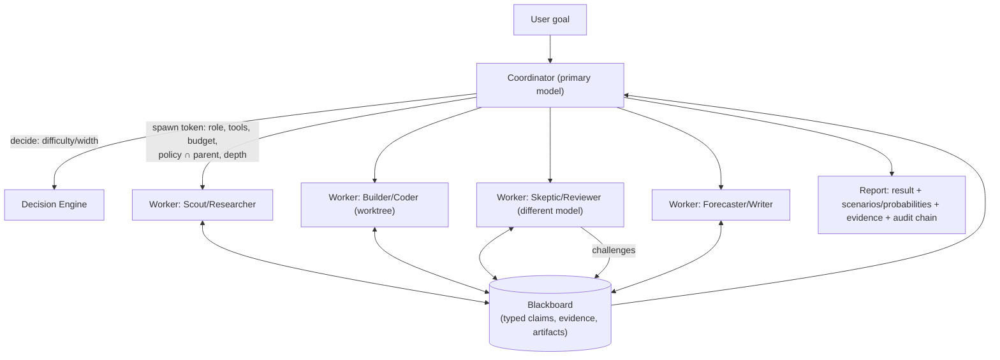
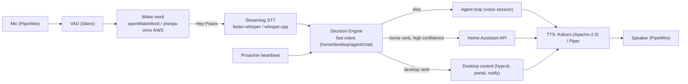

# Praxis Prime — Architecture Blueprint for a Local-First, Governed, Ambient AI Agent

> **Praxis Prime** is the flagship evolution of **SMF Praxis** (`smfworks/smf-praxis`). It keeps Praxis's governance core — "autonomy for preparation, approval for consequence", the risk broker, data policy, vertical packs and jurisdiction profiles — and grows it into a full local-first agent platform with coding, channels, swarm, a self-hosted Decision Engine and an ambient "Jarvis" layer.
>
> **Names used throughout:** repo `smfworks/praxis-prime` (proposed); CLI **`praxis-prime`** with short alias **`pprime`**; daemon `praxis-primed`; Python distribution `praxis-prime`, import package `praxis_prime`; paths `~/.config/praxis-prime/` etc. `prime` alone is **not** used as the CLI because it collides with Prime Intellect's `prime` CLI on PyPI (§33).
>
> **Status:** design blueprint only (v0.2, 2026-09-29 ET; revised with Michael's decisions on name, Decision Engine, dials and packs). No code, repos or packages exist yet.
> **Author:** prepared for Michael / SMF Works.
> **Companion files:** [`blueprint-addendum-2026-09.md`](blueprint-addendum-2026-09.md) (Addendum A, 2026-09-30, sandbox decision revised 2026-10-02: themes, no default LLM, the local sandbox, any-device access, profiles, and milestones M0–M8; §29 follows it), `CAPABILITY-MATRIX.md` (feature-by-feature comparison and reuse plan), `SOURCE-NOTES.md` (per-repo findings, licenses, file paths, unverified items), `ARCHITECTURE.html` (rendered version of this file).
>
> **Attribution:** Hermes Agent is by **Nous Research**. OpenClaw is by **Peter Steinberger, the OpenClaw Foundation and contributors**. Omarchy is by **David Heinemeier Hansson / Basecamp**. Jev / System One is by **TypeSafe AI** (used here only as a reference design; Praxis Prime does not use their service). SMF Works authored SMF Praxis and SMF Swarm 2.0 and does not own any of the others. Reusing their code is allowed under their licenses (§32). Nothing here implies endorsement by those authors.

---

## 0. TL;DR — the top decisions

| # | Decision | Why |
|---|---|---|
| 1 | **Python 3.12+ core daemon (`praxis-primed`)**: asyncio, FastAPI/uvicorn, SQLite (WAL) + FTS5 + sqlite-vec | Hermes, Praxis and Swarm 2.0 are all Python and MIT, so their code can be reused directly. SMF already ships FastAPI apps. Local ML (faster-whisper, openWakeWord, ONNX Runtime, GLiClass) is Python-native. |
| 2 | **One typed gateway protocol** (WebSocket + JSON-Schema frames, pairing, idempotency) that every client uses: CLI, TUI, web, desktop, Omarchy bar, phone channels, nodes | This is OpenClaw's strongest idea (`127.0.0.1:18789`, `connect`-first frames, signed device pairing). It is re-implemented in Python by design, not by porting code. |
| 3 | **Tauri 2 desktop shell + a React/Vite SPA** that is also served by the daemon as the web UI | Small footprint. OpenClaw's `apps/linux` already proves Tauri v2 with .deb and AppImage on Ubuntu 22.04+. Electron stays the fallback if WebKitGTK rendering issues arise (Hermes uses Electron). |
| 4 | **The loop invariants come from Hermes**: byte-stable system prompt, strict role alternation, and compression as the only cache break. **Queue modes come from OpenClaw**: steer / followup / collect / interrupt. **Governance comes from Praxis**: perceive → plan → govern → act → reflect. | Each is the best-in-class version of its piece. |
| 5 | **A baseline safety spine that is always on and cannot be switched off**, separate from **regulatory compliance dials that are off by default** | Michael wants the dials off by default. Praxis defaults to ENFORCED. The resolution: consequential actions (send, delete, spend, share) always need approval; only the regulatory overlays are optional. |
| 6 | **Policy-as-code**: TOML dial files compile into one Policy Engine with 7 hook points. An optional OPA/Rego or Cedar hook may only **tighten** policy, never weaken it. Swarm children inherit the **intersection** of policies. **First dials: HIPAA, FERPA/COPPA, GDPR, the 13 Praxis state packs, and a new North Carolina pack.** | Reuses Praxis `broker.py` + `data_policy.py` semantics, bundles the Praxis regulated packs (approved by Michael), and adds the missing dials. |
| 7 | **Our own self-hosted, Jev-equivalent Decision Engine, merged with the swarm**: typed `decide()` (choice / score / yes-no) with calibrated probabilities. It is a cascade — rules → fine-tuned small classifiers → constrained small-LLM judges with logprob calibration → a **Jury** of judges (Swarm 2.0 personas + model diversity) → escalation to a bigger model or a human. The request/response shape mirrors TypeSafe's public API. | Michael decided against hosted TypeSafe Jev. A local cascade keeps data on the machine, is measurable (ECE/Brier), and reuses Swarm 2.0's personas, audit log, identity and permissions. It is escalate-only and never the sole security check (§7). |
| 8 | **The Jarvis layer is a separate ambient subsystem**: wake word, streaming voice in and out, Home Assistant, desktop control and a proactive heartbeat. It runs as its own `praxis-prime-voice` user service. | Keeps always-listening audio isolated, easy to disable, and permission-scoped. Hermes already has on-device wake word, STT and TTS to reuse. |
| 9 | **Sandbox tiers**: bubblewrap + Landlock/seccomp (default) → rootless Podman → microVM (Firecracker, optional) → remote (SSH, Daytona, Modal) | Matches the Codex and Claude Code Linux approach (bubblewrap), plus Hermes's remote backends. No NVIDIA security container (Addendum A decision C). |
| 10 | **Packaging**: signed APT repo + .deb + AppImage for Ubuntu; AUR `praxis-prime-bin`/`praxis-prime-git` + an Omarchy installer, theme template, Quickshell bar plugin and keybind for Omarchy. **MIT license.** | Matches how Omarchy already integrates Hermes and OpenClaw. MIT is compatible with every reused source. |

---

## 1. Vision & principles

**Vision.** A single personal and professional agent that lives on your Linux machine. It:
- chats and codes like Claude Code, Codex or Cursor;
- runs routines and reaches you on any channel like Grok Bot, Hermes or OpenClaw;
- listens and acts ambiently like "Jarvis";
- runs a governed swarm for big jobs;
- can be dialed up to regulated-industry compliance (HIPAA, FERPA and others) without forking.

**Relationship to SMF Praxis.** Praxis Prime is Praxis's next generation, not a separate product line.
- **Carried forward from Praxis:**
  - governance broker (risk classes, compliance modes, timed revert, kill switch, dual approval, policy hook);
  - data policy and retention;
  - memory forgetting;
  - sensitivity router;
  - identity and attestations;
  - security scan;
  - OWASP mapping;
  - vertical packs and jurisdiction profiles, **including the regulated commercial packs** (§17, §32).
- **Migration:** `praxis-prime migrate --from-praxis` imports `~/.praxis/praxis.db`, packs and memory, keeping provenance.
- **The existing `praxis-agent` package** can continue as the lightweight, dependency-free edition, or be retired (§31).

**Principles**

1. **Local-first, cloud-optional.** Everything works offline with local models (Ollama, llama.cpp, vLLM, LM Studio). Cloud models and remote sandboxes are opt-in per task and can be blocked by policy.
2. **Autonomy for preparation, approval for consequence.** This is Praxis's rule, and it is the baseline spine. Reading, researching and drafting are free. Sending, deleting, spending, sharing and publishing need a human.
3. **Narrow-waist core, capability at the edges.** From Hermes: a small, stable kernel (loop, router, policy, memory, gateway). Everything else is a plugin, skill or MCP server. Follow Hermes's Footprint Ladder: extend existing → CLI + skill → gated tool → plugin → MCP → core tool.
4. **One protocol, many faces.** From OpenClaw: every UI and channel is a client of one typed gateway. There are no private backdoors.
5. **Untrusted by default.** All tool output, web pages, email, documents and channel messages are treated as data, never as instructions. They are fenced, labeled and screened before the model sees them.
6. **Evidence or it didn't happen.** Every decision, approval, tool call and policy verdict is written to an append-only, hash-chained audit log. This combines Swarm 2.0's `governance/audit.py` with Praxis's evidence chain.
7. **Cache-stable prompts.** From Hermes: the system prompt is byte-stable within a session and compression is the only cache break. Cost and latency matter for an always-on agent.
8. **Fast brain / slow brain.** Cheap, calibrated System-1 decisions (the local Decision Engine and its Jury) gate and route expensive System-2 reasoning (the LLM).
9. **Compatible, not captive.** Read `AGENTS.md`, `CLAUDE.md`, `.cursor/rules/*.mdc` and SKILL.md (agentskills.io); speak MCP both ways; offer ACP for editors; import from Hermes and OpenClaw.
10. **Desktop-native on Linux.** Wayland-first (Hyprland/Omarchy, GNOME, KDE), with X11 fallback, systemd user services and XDG paths.

## 2. Non-goals (for v1.0)

- Not a new foundation model, and not a hosted SaaS. Multi-tenant cloud hosting is out of scope (a single-user or small-team daemon only).
- No Windows or macOS builds in v1.0. The protocol and UI are portable, but the effort goes to Linux. macOS nodes may pair later.
- No certified compliance. The dials give **technical controls and evidence**, not legal certification. SOC 2 and ISO 42001 attestations are organizational processes; HIPAA needs BAAs; FERPA needs institutional agreements. Every dial page will say so.
- No fork of Hermes or OpenClaw as the product. We **reuse modules and patterns** (with attribution) but keep our own kernel, grown from Praxis (§31, open questions 3–4).
- No mobile apps in v1.0. Phones connect through channels (Telegram, Signal, SMS, etc.) and through the web UI or PWA.
- No unattended purchases or payments, ever, even with every dial off. They stay behind the approval spine.

---

## 3. System overview



### 3.1 Process topology



- The **daemon is the single source of truth.** Clients never touch the database directly.
- Voice and channel adapters run as **separate processes** so a crash, a leaking microphone stream or a misbehaving third-party SDK can't take down the kernel. They pair like OpenClaw nodes (`role: node`, declared capabilities and commands).
- Default ports: `18790` (TCP, loopback only), chosen to avoid OpenClaw's `18789` so both can be installed side by side. The CLI prefers the Unix socket.

When `profiles/` exists, `praxis-primed` is the supervisor and does not open a profile database. Each profile has its own worker process (`python -m praxis_prime.worker`) with that profile's memory, skills, routines, and approval queue. The worker binds the existing profile and data-root stacks (`bind_profile`, `bind_data_root`). Idle workers exit and start again on the next request. A crash waits through exponential backoff (0.5s, doubling, capped at 30s) before the next start. An install with no profile directory still runs the agent in the daemon process, so a pre-migration checkout keeps the same CLI. The M1c marker `supervisor/m1c.json` is written once and does not move `prime.db` again.



The trust boundary is in [SECURITY.md](SECURITY.md). Landlock and a separate Linux user per profile are not this process split. NVIDIA GPUs may still be used for model inference. Isolation is Praxis Prime's own sandbox, not an NVIDIA security container.

---

## 4. The Gateway Protocol

A re-implementation of OpenClaw's ideas in Python, not a port of its TypeScript.

| Concern | Design |
|---|---|
| Transport | WebSocket over the Unix socket (CLI, local) or loopback TCP (UI). Remote access only via a tunnel (Tailscale/WireGuard/SSH) plus pairing. There is never a public bind by default. |
| Framing | JSON frames `{type, id, idempotencyKey?, sessionId?, payload}`. Schemas are written as **Pydantic v2 models → exported JSON Schema → generated TypeScript types** for the UI (OpenClaw does TypeBox → JSON Schema; we invert it for a Python core). |
| Handshake | The first frame must be `connect` (client kind, version, capabilities). Unknown clients must **pair**: the daemon issues a challenge, the device signs it with an Ed25519 key (reuse Praxis `identity.py`), and the user approves on an existing trusted face. |
| Roles | `operator` (full UI), `viewer` (read-only), `channel` (a messaging adapter), `node` (a device offering commands such as mic, camera, screen, notify, location), `agent` (a swarm child). |
| Sessions & lanes | Each session has a serialized lane; there is a global lane for cross-session work. Queue modes follow OpenClaw: **steer** (inject into the running turn), **followup** (queue after), **collect** (batch), **interrupt** (cancel and replace). |
| Idempotency | Every mutating frame carries an `idempotencyKey`, so channel retries never double-send. |
| Streaming | Token deltas, tool-call start/end, approval requests, policy verdicts, swarm events and canvas updates are all event frames on one socket. |
| OpenAI-compatible API | Optional `/v1/chat/completions` and `/v1/responses` routes (Hermes has an `api_server`) so other tools can use Praxis Prime as a "model". This is off by default. |

---

## 5. Agent loop



**Phases** (Praxis's cycle mapped onto a Hermes-style turn):

1. **Perceive**: normalize input (text, voice transcript, image, file, event). Tag its provenance and trust level. Screen it for injection. Perception output is "data only" (Praxis `perception.py`).
2. **Plan**: build the prompt from the **byte-stable system prompt**, the skills index, the memory snapshot and the conversation. Long tasks get an explicit plan or todo list, shown in the UI.
3. **Govern**: every tool call goes through the Policy Engine (§16) *before* execution.
4. **Act / Draft**: run tools in the right sandbox tier. Consequential actions produce a **draft plus an approval card** instead of acting.
5. **Reflect**: check the result against the goal. The Decision Engine can score "task complete?" and "needs user?" cheaply. On failure, retry with a capped budget.
6. **Consolidate**: gated memory writes, skill-creation suggestions (Hermes curator), and audit seal.

**Invariants (from Hermes):**
- The system prompt never changes mid-session.
- Roles strictly alternate.
- Tool results are paired with their calls.
- Compression is the only cache break, and it keeps the first and last turns with a summary in between.
- `max_iterations` is configurable (Hermes defaults to 500; Praxis Prime defaults to 200 for interactive use and uses budget caps for background work).

**Budgets:** each turn and each task has token, cost ($), wall-clock and tool-call budgets. Exceeding one pauses the task and asks the user; there is no silent overspend.

---

## 6. Model router & providers

- **Provider plugins** (Hermes-style `plugins/model-providers/`): OpenAI, Anthropic, xAI, Google, OpenRouter, Azure; and local Ollama, llama.cpp server, vLLM, SGLang and LM Studio — any OpenAI-compatible endpoint.
- **Roles, not one model.** Following OpenClaw's model roles:

| Role | Default | Used for |
|---|---|---|
| `primary` | user's choice (local or cloud) | main conversation and coding |
| `utility` | small, fast local model | titles, summaries, compression, tool-output digests (Hermes `auxiliary_client.py`) |
| `reviewer` | a different model from primary | the auto-review risk judge and swarm "Skeptic" |
| `decision` | Decision Engine (§7) | typed classification and routing |
| `vision` | multimodal model | screenshots, computer use |
| `embed` | local embedding model | semantic memory |
| `stt` / `tts` | local | Jarvis layer |

**Routing rules**, evaluated in order:
1. **Policy pins.** If data is classified CONFIDENTIAL or higher, or a dial requires residency, only allowlisted models are eligible. Praxis `router.py` already pins sensitive content to local models.
2. **Explicit user choice.**
3. **Decision Engine intent routing.** For example, `choice(["quick answer", "coding", "research", "home control", "creative", "sensitive/legal/medical"])` picks the model tier and tool set.
4. **Cost and latency budget.**
5. **Fallback chain** on errors or rate limits. The fallback chain never crosses a policy pin.

---

## 7. Decision Engine — Praxis Prime's own, self-hosted "Jev-equivalent"

**Decision (Michael, 2026-09-29): Praxis Prime does NOT use TypeSafe's hosted Jev.**
- We build our own **open, self-hosted Decision Engine (DE)**. It gives fast, typed decisions — *choice*, *score*, *yes/no* — with **calibrated probabilities**, running entirely on the user's machine.
- It is **merged with the swarm**. Hard or contested decisions go to a **Jury**: several small local judges vote, the votes are combined into one calibrated answer, and disagreement escalates.
- TypeSafe's Jev is used only as a **reference design**. Its public API shape and published limitations inform ours (research in `SOURCE-NOTES.md` §6). There is **no runtime dependency on TypeSafe's service**, no API key and no data sent to them.

### 7.1 What we borrow from Jev (ideas only) and what we change

| Jev (TypeSafe, hosted, proprietary) | Praxis Prime DE (local, MIT) |
|---|---|
| `state` + map of typed `questions` → map of typed `answers` | **Same shape** (§7.3), so code written against TypeSafe's MIT SDKs can be pointed at our loopback endpoint. Compatibility is a *goal*, to be verified field-by-field. |
| Three primitives: `choice` (≤255 options), `score` (2–10 ordered levels), `noul` (yes/no) | Same three primitives and limits (we call `noul` "yes/no" in our docs but accept `"noul"` on the wire) |
| Purpose-trained "System One" model (RLCD) | A **cascade**: rules → fine-tuned small classifiers → constrained small-LLM judges with logprob calibration → **Jury** (swarm of judges) → big model or human |
| "Calibrated probabilities" (vendor claim) | Calibration is **measured and fitted locally** (temperature scaling, Platt, isotonic) per question template, and published in a reliability report (§7.6) |
| Known weaknesses: literal reading, math/dates/counting, large irrelevant state, **adversarial content can steer answers** (TypeSafe "Jev 1.13 jaggedness" page) | We assume our judges share these weaknesses: numbers, dates and counts stay in code; state is shortlisted; a dedicated adversarial judge; **escalate-only** safety rule (§7.7) |

### 7.2 Architecture: a cascade with an escalation ladder



- **Every tier returns the same typed answer.** A tier "passes" only if its *calibrated* confidence clears the template's `min_confidence` **and** the policy for that purpose allows that tier to decide alone. For example, `risk_triage` can never be settled by T1 alone when the action is SEND-class.
- **Budgets per call:** a latency budget (for example, the voice fast path allows ≤300 ms, so T0–T2 only) and a compute budget. Past its budget, the DE returns its best answer so far **marked `escalate: true`**, and the caller must take the safe path.

### 7.3 API & schema (mirrors TypeSafe's public shape; our own implementation)

Loopback endpoints on the daemon:
- `POST /v1/decide` (native)
- `POST /v1/systemone` (compatibility alias)

In-process API: `praxis_prime.decide.decide()`. The CLI command is `praxis-prime decide`.

```json
// Request (identical top-level shape to TypeSafe's documented API)
{
  "model": "prime-decide-default",          // a DE profile name, not a vendor model
  "state": {"message": "Help! My payouts have been failing for 3 days."},
  "questions": {
    "is_urgent":  {"type": "noul",   "instructions": "Does this convey urgency?",
                   "criteria": {"true": "Explicitly time-sensitive", "false": "No urgency expressed"}},
    "department": {"type": "choice", "instructions": "Which team should handle this?",
                   "criteria": {"billing": "Payments, invoicing, refunds",
                                "technical": "Bugs, outages, integrations",
                                "sales": "Pricing, upgrades, new accounts"}},
    "frustration":{"type": "score",  "instructions": "How frustrated is the customer?",
                   "criteria": ["Calm", "Frustrated", "Very angry"]}
  },
  "x_prime": {                               // optional extensions (ignored by compat clients)
    "purpose": "inbox_triage", "data_class": "INTERNAL",
    "latency_budget_ms": 400, "max_tier": "T3", "min_confidence": 0.8
  }
}
```

```json
// Response
{
  "model": "prime-decide-default",
  "answers": {
    "is_urgent":  {"type": "noul", "noul": 0.93},
    "department": {"type": "choice", "choice": "billing",
                   "probabilities": {"billing": 0.86, "technical": 0.13, "sales": 0.01},
                   "confidence": 0.84},
    "frustration":{"type": "score", "score": 1.08,
                   "legend": {"0": "Calm", "1": "Frustrated", "2": "Very angry"},
                   "probabilities": {"0": 0.02, "1": 0.88, "2": 0.10}, "confidence": 0.86}
  },
  "usage": {"input_tokens": 212, "output_tokens": 3},
  "x_prime": {
    "decision_id": "dec_01J…", "audit_seq": 48213,
    "tiers": {"is_urgent": "T2", "department": "T1", "frustration": "T3"},
    "raw_probabilities": {"...": "pre-calibration values per tier/judge"},
    "calibrator": {"department": "temp_scaling@v7"},
    "jury": {"frustration": {"judges": 3, "js_divergence": 0.04, "votes": {"1": 3}}},
    "escalate": false, "latency_ms": 184
  }
}
```

**Schema rules:**
- Up to 255 choice options; 2–10 score levels. `instructions`/`criteria` accept a string, object or array, as in TypeSafe's docs.
- The `x_prime` extension block is optional. Open item: if TypeSafe's MIT SDK rejects unknown fields, extensions move behind `?extended=1`. Verify during implementation.
- **Confidence is separate from probability.** It is the DE's calibrated estimate that the *top answer is correct*, estimated from margin, entropy, judge agreement and tier history on held-out data. For yes/no answers the wire format carries only `noul`, as TypeSafe does; confidence goes in `x_prime`.
- Pydantic models live in `praxis_prime/decide/schema.py`, with JSON Schema exported to `protocol/decide.schema.json`.

### 7.4 How each tier produces probabilities

| Tier | Technique | Notes |
|---|---|---|
| **T0 rules** | Deterministic detectors (SSNs, PANs with Luhn check, secrets, NC/US identifiers — §17.2), allowlists, parsers for numbers and dates | The output is 0/1 with provenance. Numbers, dates and counts are **always** decided here, never by a model (Jev's documented failure modes 2–3 apply to our judges too). |
| **T1 classifiers** | Small encoders fine-tuned per high-volume template: ModernBERT-base / DeBERTa-v3-small heads; **SetFit** few-shot for new templates; **GLiClass** zero-shot and **GLiNER** span-NER for PII; exported to ONNX Runtime (CPU/iGPU) | Softmax outputs are calibrated with **temperature scaling** (multi-class) or **Platt/isotonic** (binary). The trained heads are the fast path that the Jury "teaches" (distillation, §7.5). |
| **T2 LLM judge** | A small instruct model (1–4B, Q4/Q5 GGUF) served by **llama.cpp server** (`json_schema`/`grammar` constraints + `n_probs`) or **Ollama ≥ 0.12.11** (added `logprobs`/`top_logprobs`). vLLM/SGLang are optional. | Options are relabeled to **single-token labels** (A, B, C… or 0…9) so one constrained token carries the whole distribution. Softmax over the label logprobs gives raw probabilities, then per-template calibration. Choices with more than about 26 options: BM25/embedding shortlist, then judge (Jev-style fan-out). Score = the expectation over the level distribution. The state goes in a **cached prefix**, so N questions on the same state reuse the KV cache (llama.cpp slot/prompt cache). |
| **T3 Jury** | K = 3–5 judges in parallel (§7.5); the calibrated distributions are combined with a **weighted logarithmic opinion pool** (default) or linear pool; the pooled result gets a final isotonic calibration | Disagreement = Jensen–Shannon divergence across judges plus a vote split. Weights are learned on the eval set (judges with better Brier scores weigh more). |
| **T4 escalation** | Reviewer or primary model with reasoning (a local 14–32B model; cloud only if policy allows the data class), or a **human** via an approval card | Returns the same typed answer. The human answer becomes a gold label (§7.6). |

**Candidate models** (the final choice comes from the eval harness, not this doc):
- **T2 judges:** Qwen3 0.6B/1.7B/4B, Gemma 3 1B/4B, Llama 3.2 1B/3B, Phi-4-mini.
- **T1 encoders:** ModernBERT, DeBERTa-v3, GLiClass, GLiNER.

**Model licenses differ** (for example, Llama and Gemma have custom terms). Verify each one before bundling; the default is to download on first run after the user accepts the terms.

### 7.5 The Jury: the swarm, merged into the Decision Engine

The Jury is a **micro-swarm** of judges. Each is a swarm worker with **no tools**. It is spawned under the same spawn-token and policy-intersection rules as §15, and it reuses SMF Swarm 2.0's pieces directly:

| Swarm 2.0 piece (MIT, SMF Works) | Role in the Jury |
|---|---|
| **Personas** (`analysis/engine.py`: Scout — evidence extraction; Strategist — scenario design; Skeptic — risk & confounds; Forecaster — prediction synthesis) | Become **judge lenses**, each with its own system prompt. **Scout** answers strictly from quoted evidence in the state. **Strategist** reads intent and context. **Skeptic** is the *adversarial judge*: it looks for injected instructions and self-serving framing and argues for the riskier reading. **Forecaster** estimates outcome likelihood. |
| **`governance/audit.py` AuditLog** (SHA-256 hash chain, `verify_chain()`) | Every decision is appended as one event: template id and version, tiers used, per-judge raw and calibrated distributions, pooled result, disagreement, escalation and final answer. `praxis-prime audit verify` covers decisions too. |
| **`governance/identity.py` IdentityRegistry** | Each judge (model + persona + calibrator version) gets an identity, so its answers are attributable and its weight is tracked over time. |
| **`governance/permissions.py` PermissionEngine** (deny by default) | Judges are granted exactly one capability, `decide.read_state`. No tools, no network, no memory writes. |
| **Report schema** (scenarios, probabilities, evidence) | Jury transcripts render in the swarm visualizer (§21.3) as a "decision card". |

**Jury composition** (configurable per template):
- **Diversity first:** at least 2 different base models when the hardware allows. A persona prompt alone on a single model is weaker, because persona-only ensembles are correlated. The default Jury is 3 judges: Scout@modelA, Skeptic@modelB, Strategist@modelA.
- **Escalation rules:**
  - Pooled confidence < `min_confidence`, **or** JS divergence > `τ_disagree` (default 0.15), **or** the Skeptic's P(risky) exceeds the pool by more than 0.2 → escalate to T4.
  - For safety purposes (risk triage, injection, data class), escalation can only move toward the **safer** outcome (§7.7).
- **Distillation — "the swarm teaches the fast path":**
  - Jury decisions with high agreement, plus human-confirmed T4 outcomes, become training labels for the T1 classifiers of high-volume templates (intent, urgency, injection, data class).
  - A nightly local job fine-tunes and recalibrates them, and **only promotes a new head if it beats the old one on the frozen eval set with no safety regressions.**
  - Labels from data classes a dial restricts (for example PHI) stay on the machine and are used only if the dial allows local training.
- **The swarm uses the DE in return:** it calls the DE for task triage (difficulty → spawn width), for claim checks on the blackboard ("is this claim supported by its cited evidence?") and for "done?" checks.

### 7.6 Calibration & eval harness

- **Calibrators** are kept per *(question template, tier/judge, model version)*:
  - temperature scaling (multi-class, one parameter);
  - Platt scaling or **isotonic regression** (binary; isotonic once there are about 1k or more labels);
  - optional Dirichlet calibration (v1.0).

  They are stored versioned in `~/.local/share/praxis-prime/decide/calibrators/`, and every answer records the calibrator version it used.
- **Labels come from:**
  - curated seed sets per template, shipped with Praxis Prime;
  - human approvals, denials and corrections from approval cards;
  - explicit user feedback ("that wasn't urgent");
  - synthetic adversarial sets.

  Labels are kept in `decide/labels.db` and governed by the data-class rules.
- **Metrics** (per template and tier): accuracy / macro-F1, **ECE and MCE**, **Brier score**, NLL, AUROC (binary), **selective risk–coverage** curves (error rate when we act only above confidence c), escalation rate, p50/p95 latency, and **safety-regression count** (any case where the DE would have lowered a risk class — must be 0).
- **Harness** (`praxis-prime eval decide`, also in CI):

  | Suite | Contents |
  |---|---|
  | `injection` | Injected instructions, text that argues for its own classification, and obfuscation — this targets Jev's documented failure mode 6 |
  | `data_class` | Synthetic PHI, FERPA, PCI and NC identifier records |
  | `intent` / `skill_select` | Routing and skill choice over the Hermes-format skill catalog |
  | `risk_triage` | Replayed, redacted audit-log actions with human verdicts |
  | `voice_intents` | The Jarvis command set |
  | `literal` | Negation, scoping and boundary cases |
  | `numbers_dates` | Must route to T0; a model answering fails the test |

  Output is a **reliability report** (reliability diagrams + table) in the dashboard, and `evals/decide/REPORT.md`.
- **Drift:** rolling ECE and accuracy on fresh labels. If a template's ECE exceeds the threshold or accuracy drops, the DE **automatically raises that template's escalation rate** (lowers trust) and opens a recalibration job.
- **Reference material** (not dependencies): TypeSafe's public cookbooks and patterns (fan-out, confidence-gated routing, composite scoring, guardrails, citation check) and its Apache-2.0 `WorkflowEvals` inform the suite design.

### 7.7 Safety rule (unchanged, non-negotiable)

1. **Escalate-only.**
   - The DE may **raise** a risk class, force an approval, add a dial tag, block content, or pin work to local models.
   - It may **never lower** a risk class, skip an approval, or remove a tag that rules (T0) or policy set.
   - Enforced in the Policy Engine: DE outputs are merged with `max(risk)`, never `min`.
2. **Never the sole security check.** Injection screening = rules + DE (including the adversarial Skeptic judge) + the reviewer LLM for consequential actions. **The baseline approval spine (§16) applies no matter what the DE says.**
3. **State is untrusted data.** It is fenced and never mixed into judge instructions. Judges get no tools, and a steered judge can at worst fail to escalate.
4. **Low confidence or disagreement always resolves to the safer path:** escalate, ask the human, or deny.
5. **Code decides numbers, dates, counts, money and budgets.**
6. **Fully auditable:** every decision is in the hash-chained log with all judge outputs.

### 7.8 Latency targets (design targets to validate — not measurements)

| Path | Hardware | p50 target | p95 target |
|---|---|---|---|
| T0 rules | any | < 1 ms | < 2 ms |
| T1 classifier (≤512 tokens, batch of questions) | CPU (4+ cores) | ≤ 15 ms | ≤ 40 ms |
| T2 single judge, 1–4B Q4, cached prefix, 1 label token | GPU ≥ 8 GB VRAM | ≤ 120 ms | ≤ 300 ms |
| T2 single judge | CPU-only laptop (1–2B model) | ≤ 600 ms | ≤ 1.5 s |
| T3 Jury, 3 judges in parallel | GPU ≥ 12 GB (or 2 small models) | ≤ 250 ms | ≤ 600 ms |
| T3 Jury | CPU-only | ≤ 1.5 s | ≤ 3 s (background paths only) |
| Voice fast path (end of speech → routed command, DE portion) | GPU / CPU | ≤ 150 ms / ≤ 300 ms | ≤ 300 ms / ≤ 600 ms |
| T4 escalation | — | seconds (async; the UI shows "checking…") | — |

**Hardware profiles** are picked automatically by `praxis-prime doctor`:
- `cpu-lite`: T0 + T1, plus T2 on a 1B model; the Jury only for background work.
- `gpu-8g`: T0–T3 with 3 judges on 1.5–4B models.
- `gpu-16g+`: adds larger judges and a local T4 reviewer.

### 7.9 Where the Decision Engine is used

| Use | Question shape | Default max tier |
|---|---|---|
| Intent → model/tool routing | choice over intents | T2 |
| Skill selection | choice over a BM25 top-k shortlist of skill descriptions | T2 |
| Auto-review risk triage | score none…critical; yes/no "irreversible?", "external recipient?" | T3 (Jury) → T4 on disagreement |
| Prompt-injection / jailbreak screening | yes/no "instructions aimed at the agent?"; severity score | T3 with the Skeptic always seated |
| Data classification for dials | choice over PUBLIC … PHI / EDUCATION_RECORD / PCI / NC_PII / EVIDENCE | T1 → T3 |
| Memory-write gating | yes/no "durable fact?", "sensitive?"; importance score | T2 |
| Proactive triage (Jarvis) | urgency score; yes/no "interrupt now?" | T2 |
| Voice command routing | choice over home / desktop / agent / chat verbs | T1/T2 (latency budget) |
| Swarm triage & claim checks | difficulty score → spawn width; yes/no "claim supported by evidence?" | T3 |
| Channel spam and priority | choice / score | T1 |

---
## 8. Tools & MCP

**Tool registry** (pattern from Hermes `tools/registry.py` + `toolsets.py`):
- Each tool is a Python function with a Pydantic argument schema, auto-registered.
- Every tool declares:
  - a **risk class** (READ / DRAFT / SEND / DESTRUCTIVE / SPEND / SHARE). This extends Praxis's four classes with SPEND and SHARE, because Michael's approval rules single them out.
  - its **side-effect scope**: filesystem paths, network hosts, devices.
  - a **sandbox tier** requirement.
  - an optional `check_fn` availability gate.
- **Toolsets** group tools per mode: `core`, `coding`, `web`, `desktop`, `home`, `comms`, `admin`. Per-agent and per-pack allowlists come from Praxis vertical packs.

**Core tools (MVP):**
- `read_file`, `write_file`, `edit` (patch-based), `grep`, `glob`
- `shell` (sandboxed), `process` (background jobs)
- `web_search`, `web_fetch`, `browser` (CDP, isolated profile)
- `memory`, `todo`, `ask_user`
- `delegate` (swarm), `schedule`, `decide` (the Decision Engine as a tool), `notify`

**MCP:**
- **Client:** stdio, streamable HTTP and SSE, with OAuth 2.1 (Hermes `tools/mcp_tool*.py`). Server **tool annotations** (`readOnlyHint`, `destructiveHint`, `openWorldHint`) map to risk classes. As in Codex, destructive-annotated tools always require approval. A server without annotations defaults to SEND-level risk until the user classifies it.
- **Server:** `praxis-prime mcp serve` exposes memory, skills, `decide`, and a safe subset of tools to other agents (Claude Code, Cursor, Codex). It is off by default.
- **Security scan:** every new MCP server or skill is graded A–F before it is enabled (Praxis `security_scan.py`), and the grade shows in the UI. Remote MCP egress goes through the policy egress allowlist.

**Editor protocol:** ACP adapter for VS Code, Zed and JetBrains (Hermes `acp_adapter/` is a reference).

## 9. Skills

- **Format:** `SKILL.md` with YAML frontmatter (name, description, version, requires, platforms, risk). This is compatible with agentskills.io, Hermes, OpenClaw/ClawHub and Claude Code. Skills load progressively: only the name and description go into the index; the body loads on use.
- **Locations** (in precedence order):
  - `./.prime/skills/` (project)
  - `~/.config/praxis-prime/skills/` (user)
  - `~/.agents/skills/` (shared — Omarchy symlinks its skill here)
  - bundled skills
  - installed packs
- **Hub:** install from GitHub or a skills registry, with a mandatory security scan (Hermes skills guard + Praxis A–F grading) and a lockfile with hashes.
- **Self-improvement:** after a successful multi-step task, the loop may **propose** a new skill or a patch (Hermes curator). Writing a skill counts as DRAFT, so the user reviews it. Skills can never grant themselves tools that the pack allowlist forbids.
- **Selection:** a BM25 shortlist, then a Decision Engine choice (TypeSafe's Hermes-catalog skill-suggestion pattern), then the model confirms.

## 10. Memory (4 tiers)

| Tier | What | Store | Lifetime | Source of idea |
|---|---|---|---|---|
| **1. Working** | current context, plan, scratchpad | in-prompt + session row | the turn or session | Hermes loop, Praxis scratchpad |
| **2. Episodic** | transcripts, tool results, events | SQLite + FTS5 (`sessions`, `messages`) | TTL per data class; decays | Hermes SessionDB/FTS5 search, Praxis `decay_episodic` |
| **3. Semantic** | facts, user profile, entities, documents | SQLite + sqlite-vec (LanceDB optional) + a small entity graph | until forgotten; provenance-tagged | Hermes memory + user profile, OpenClaw memory-core/lancedb, Praxis |
| **4. Procedural** | skills, playbooks, learned preferences for how to do things | files (SKILL.md) + an index | versioned | Hermes skills + curator |

- **Writes are gated.** Every memory write passes Policy hook **H6**. It classifies the data, applies the TTL from the data class, blocks writes the dials forbid (for example, PHI to cloud-synced memory), and records provenance: `source`, `session_id`, `channel`, `trust`.
- **Forgetting:**
  - `praxis-prime memory forget --provenance <x>`, `--before <date>`, `--subject <entity>`. This reuses Praxis `forget_by_provenance`.
  - A retention sweeper runs daily (Praxis `purge_expired`).
  - **Legal hold** overrides TTL.
- **User-visible memory:** a Memory panel lists every stored fact with its source and a delete button. There are no hidden memories.
- **Memory provider plugins** (optional): mem0, Honcho, Supermemory and similar, following the Hermes `plugins/memory/` contract. They are blocked under dials that forbid egress.
- **Nudges:** Hermes-style "anything worth remembering?" prompts happen every N turns, via the Decision Engine rather than an LLM call.

## 11. Scheduler, triggers & routines

- **Routines** are an agent prompt plus a trigger, a toolset, a budget, a delivery target and a policy profile — like Grok Bot routines, Hermes `cron/` and OpenClaw cron.
- **Triggers:**
  - cron expressions and natural language ("every weekday 8am" → cron);
  - intervals and one-shots;
  - **events**: new email, channel message, webhook, file change (inotify), git push, calendar event, Home Assistant state change, system events (login, idle, battery via logind/UPower/D-Bus);
  - **heartbeat** (Jarvis, §19).
- **Execution:** each run gets a fresh session, runs headless under its policy profile, and **delivers** to a channel, the desktop notification area, email or a file. Consequential actions inside a routine still produce approval cards that wait. They never auto-approve because "nobody is around".
- **Storage:** a `jobs` table plus an APScheduler-style runner inside `praxis-primed`. There is catch-up on wake (a missed-run policy of skip, once or all) and a per-job concurrency lock.
- **Management:** `praxis-prime routine add|list|pause|run-now|logs`, and a UI calendar view.

## 12. Gateway & channels

- **Channel adapters** are plugins in the style of Hermes `plugins/platforms/*` and OpenClaw's channel extensions:
  - **MVP:** Telegram, Signal, Email (IMAP/SMTP), Slack, Discord, generic webhook.
  - **v0.5:** WhatsApp, Matrix, Microsoft Teams, SMS (Twilio), ntfy, Home Assistant conversation.
  - **v1.0:** Mattermost, Google Chat, IRC, A2A.
- **Identity mapping:**
  - Each channel sender maps to a known contact or stays `unknown`.
  - Unknown senders get read-only, no-tool replies, or are ignored (configurable).
  - Owner-only commands need the paired owner identity.
- **Approvals in channels** (OpenClaw pattern): an approval card is rendered natively (buttons where supported), or as `/approve <id> allow-once|allow-session|deny`. **A free-text "yes" never authorizes.**
- **Voice memos** are transcribed locally (faster-whisper) before entering the loop.
- **Delivery policy:** outbound messages are SEND risk. The default is to **draft and ask**. Per-recipient "trusted auto-send" rules are allowed only when no dial forbids them, and they are always audited.

## 13. Computer use & sandboxing

### 13.1 Sandbox tiers

| Tier | Tech | Default for | Notes |
|---|---|---|---|
| T0 in-process | Python | READ tools on allowlisted paths | No shell. |
| **T1 bubblewrap** | `bwrap` + Landlock (kernel ≥5.13) + seccomp; network namespace off unless allowed; workspace bind-mounted read-only unless a write was approved for that worktree; home and the main checkout are never read-write | **all `shell` calls** | Same approach as Codex and Claude Code on Linux. bubblewrap (LGPL-2.0+) is called as an external binary. |
| T2 container | rootless Podman (Docker optional) with the per-project image `.prime/environment.toml` | builds, untrusted repos, swarm workers | Like Cursor's `.cursor/environment.json` and Hermes's docker backend. |
| T3 microVM | Firecracker / Cloud Hypervisor (needs KVM) | high-risk code, unknown binaries | Optional; Linux + KVM only. |
| T4 remote | SSH, Daytona, Modal, Vercel Sandbox | heavy or GPU jobs | Backends follow Hermes `tools/environments/`. Blocked by residency dials unless allowlisted. |

- **No vendor sandbox.** NVIDIA OpenShell and other NVIDIA security containers are not used; isolation is Praxis Prime's own local sandbox: the tiers in this table. T1 bubblewrap is what the code runs today (`praxis_prime.sandbox`), including the account-data tmpfs mask and the shell denylist. A hard link of a protected file planted outside the data folder is covered with a `/dev/null` bind. The set is `profiles/`, `backups/`, `accounts.db`, `audit.db`, the root `prime.db`, each database's `-wal`, `-shm`, and `-journal` sidecar (including a live WAL), `SOUL.md`, `worker-master.key`, and the runtime `gateway.token`. A scan that cannot finish refuses the launch, including a directory that cannot be listed, and the error names the folder and the reason. There is no early stop: when a protected file has another name, every mount is walked to the end and every matching name is covered, including when a mount contains the account data directory. The masked data directory is not walked, except an approved worktree. Overlapping mounts, such as a working directory and a write scope inside it, cover each sandbox path that shows the file. The check is at launch; a link created after the scan and before bubblewrap starts is not covered. A link whose other name was deleted or replaced has a link count of one and is not covered; it behaves like a copy ([Shell and the data directory](SECURITY.md#shell-and-the-data-directory)). See [Addendum A §3](blueprint-addendum-2026-09.md#3-local-sandbox).
- **Network** is off by default inside T1 and T2 (as in Codex). Per-task host allowlists go through a local egress proxy that logs every host. Policy hook H3 decides.
- **Secrets:**
  - They are stored in the OS keychain (Secret Service / libsecret, as in Praxis) or in `age`-encrypted files.
  - They are injected into sandboxes only as short-lived environment variables or a proxy.
  - The model **never sees raw secrets**; it sees placeholders (Hermes `vault_store.py` pattern).

### 13.2 Desktop computer use (host)

| Capability | Wayland (Hyprland/Omarchy) | Wayland (GNOME/KDE) | X11 |
|---|---|---|---|
| Screenshot | `grim` (+ `slurp` for region) | xdg-desktop-portal Screenshot / ScreenCast | `maim` / `import` |
| Window list / focus | `hyprctl clients -j`, `hyprctl dispatch focuswindow` | portal + D-Bus (GNOME Shell introspection is limited; flag) | `xdotool`, `wmctrl` |
| Keyboard / mouse | libei via portal **RemoteDesktop** (preferred; the user consents once), fallback `ydotool` via uinput (needs `/dev/uinput` permission; **ydotool is AGPL-3.0 — invoke only as an external binary**) and `wtype` for text | portal RemoteDesktop (libei) | `xdotool` |
| Clipboard | `wl-clipboard` | `wl-clipboard` | `xclip` |
| Accessibility tree | AT-SPI2 over D-Bus (works for GTK/Qt/Chromium when enabled) | AT-SPI2 | AT-SPI2 |

- **Default = a sandboxed virtual desktop, not your real one.**
  - Agent browsing and GUI automation run in a **nested headless compositor** (`cage` or `weston --backend=headless`, or Xvfb for X11 apps) inside a T2 container.
  - Chromium runs with a throwaway profile. The UI streams it (VNC/noVNC or PipeWire) so you can watch and take over — like the Cursor Cloud Agents remote desktop and Grok Bot's box browser.
- **Host control** (clicking in *your* session) is a separate, explicit permission (`desktop.control`). It shows an **on-screen indicator** (a Hyprland overlay or GNOME notification) and has a global **panic hotkey** (default `Super+Shift+Escape`) that kills input injection and pauses the agent.
- **Browser tool:** Playwright/CDP against a dedicated Chromium profile by default. Driving the user's signed-in browser profile needs an explicit opt-in per profile and is never the default.
- **Vision loop:** screenshot → vision model → action. It uses AT-SPI first, when available, for reliable element targeting, then pixels.

## 14. Coding mode

A first-class mode, not an afterthought, aiming for parity with Claude Code, Codex and Cursor on the essentials.

- **Instruction files**, all read and merged in a documented order (Codex-style discovery from the global file, to the repo root, to the cwd):
  - `AGENTS.md` (plus `AGENTS.override.md`)
  - `CLAUDE.md` and `.claude/rules/`
  - `.cursor/rules/*.mdc` (`alwaysApply`, `globs`, `description` honored)
  - `.github/copilot-instructions.md`
  - `.prime/rules/`

  The merged size is capped (default 32 KiB, like Codex) and reported. Writes to these files **always need approval**, even in the most permissive mode (the Hermes `protected_instruction_files` rule).
- **Worktrees:** every coding task runs in its own `git worktree` under `~/.local/share/praxis-prime/worktrees/<repo>/<task>`, so parallel tasks and swarm workers never collide (Hermes `subagent_worktree.py`, Cursor/Claude Code worktrees).
- **Edits:** patch-based `edit` with exact-match anchors. The **diff review UI** shows per-hunk accept/reject. Nothing is committed without the mode allowing it.
- **Test loop:** detect test commands (from AGENTS.md, package manifests or a Makefile), run them in T1/T2, parse the failures, iterate, and enforce a budget cap.
- **Git and forges:**
  - Local commits are DRAFT when inside the task worktree.
  - **Push, PR creation, merge, force-push and tag are SEND/DESTRUCTIVE and need approval.**
  - GitHub, GitLab and Gitea integrate via CLI or MCP.
- **Permission modes** for coding (mapping to the Claude Code, Codex and OpenClaw vocabularies):

| Praxis Prime mode | Claude Code analogue | Codex analogue | OpenClaw analogue | Behavior |
|---|---|---|---|---|
| `plan` | plan | read-only | read-only | read and propose only |
| `ask` (default) | default | workspace-write + on-request | guarded | edits in the worktree are free; shell in T1 asks unless the command is on the read-only allowlist, and the worktree bind stays read-only until a write is approved; everything else asks |
| `auto` | auto (classifier) | workspace-write + auto-review | workspace (LLM reviewer) | Decision Engine + reviewer model approve low-risk actions; 3 denials escalate to a human (OpenClaw rule) |
| `full` | bypassPermissions | danger-full-access | full | only inside T2/T3 sandboxes; **the baseline spine still applies to SEND/SPEND/SHARE and protected files** |

- **Hooks** (a Claude Code-compatible subset, configured in `.prime/hooks.toml` or read from `.claude/settings.json` / `.cursor/hooks.json` where they map cleanly):
  - Events: `SessionStart`, `UserPromptSubmit`, `PreToolUse` (allow / deny / ask / modify input), `PostToolUse`, `PermissionRequest`, `SubagentStart`/`SubagentStop`, `PreCompact`, `Stop`, `WorktreeCreate`.
  - Handler types: `command` (exit 2 = block), `http`, `mcp_tool`.
  - Hooks can **tighten** policy. A hook "allow" cannot override a policy "deny".
- **Background/cloud coding** (v1.0): run the same task in a T2/T3 or remote sandbox with a snapshot, and return a branch, a diff, test results and artifacts (screenshots/video) — the Cursor Cloud Agents model, self-hosted.

## 15. Swarm

**The swarm and the Decision Engine are one system.** The DE's Jury (§7.5) is a tool-less micro-swarm. The full swarm below uses the same spawn tokens, identities, permissions and audit chain, and it calls the DE for triage and claim checks.

The honest baseline: **SMF Swarm 2.0 today is a governance-first *analysis* app.** In LLM mode, a single prompt asks the model to role-play four personas (Scout, Strategist, Skeptic, Forecaster) and return JSON. Its reusable value is its **governance pieces** — the hash-chained audit, the deny-by-default PermissionEngine, the IdentityRegistry, the capability diagnostic and the report schema — not a multi-agent runtime. Praxis Prime's swarm is therefore a **new runtime** that adopts those pieces.



- **Spawn:** real processes or tasks, each with its own session, model role, toolset allowlist (Praxis `orchestrator.py` role allowlists), budget and sandbox tier.
- **Limits:**
  - `max_concurrent_children` defaults to 8 (Hermes's default is 10).
  - `max_depth` defaults to 2 (Hermes defaults to 1; Praxis `MAX_DEPTH=3`).
  - Global token and $ budget with per-worker slices.
- **Spawn token:** a signed (Ed25519) grant carrying role, tools, budget, depth, expiry and the **policy intersection**. A child is never more permissive than its parent, and cannot approve its own consequential actions — approvals always bubble up to the human.
- **Blackboard:** a typed store of claims, evidence, tasks, artifacts and votes in SQLite. Workers post claims with evidence links. The Skeptic challenges them, and the Decision Engine checks whether each claim is supported by its evidence.
- **Patterns:**
  - **fan-out/fan-in** (research);
  - **specialist lanes** (OpenClaw `agents team create`: coordinator / researcher / writer / reviewer);
  - **debate + judge** (Swarm 2.0 personas, now really independent);
  - **kanban** (Hermes kanban) for long-running projects;
  - **map-reduce** over files or records.
- **Output:** Swarm 2.0's report schema — scenarios with probabilities, evidence and confidence — plus the audit chain.
- **Swarm visualizer:** see §21.

---
## 16. Approvals & the Policy Engine

### 16.1 Two layers

1. **Baseline safety spine: always on. No setting, mode, hook or dial can turn it off.**
   - **Consequential actions need a human.** SEND (messages, email, posts, PRs, form submits), SPEND (purchases, paid APIs above a cap), SHARE (permission changes, public links) and DESTRUCTIVE (delete outside the workspace, force-push, drop tables) always need approval, even in `full` mode.
   - **Untrusted content is fenced** and screened for injection. Instructions found inside data are reported to the user and never executed.
   - **Protected files always need approval**: agent instruction files (AGENTS.md, CLAUDE.md, SOUL.md-style persona files), policy files, and the audit log.
   - **Kill switch.** `praxis-prime stop` or the panic hotkey pauses everything; the state is persisted (Praxis kill-switch).
   - **The audit log is always written** and hash-chained.
   - **Secrets are never shown to the model.**
2. **Compliance dials: off by default.** These are regulatory overlays that *add* restrictions and evidence (§17).

### 16.2 Policy Engine

- **Inputs:** actor (user, routine, channel sender, swarm child), action (tool + args + risk class), data classes involved, destination (host, recipient, model), active mode, active dials, and Decision Engine signals.
- **Output:** `allow | ask(approvers=[...], ttl) | deny(reason) | transform(redact/pin_local)` plus the obligations to log.
- **Implementation:** a Python rule engine compiled from TOML. There is an **optional OPA/Rego or Cedar hook that may only tighten** — the Praxis `policy_hook` contract.
- **Seven hook points:**
  - **H1** ingress
  - **H2** pre-model
  - **H3** pre-tool
  - **H4** post-tool
  - **H5** pre-send
  - **H6** memory-write
  - **H7** retention sweeper
- **Approval cards** carry the exact action (recipient, subject, body diff; command; files), the reason, the risk score, the data classes, and the buttons **allow once / allow for this session / deny / edit**.
  - Approvals are signed by the approver's paired device key, time-boxed (TTL per pack, as in Praxis 900–1800 s), and single-use by default.
  - **Dual approval (four-eyes)** is available per dial or pack for DESTRUCTIVE or SEND (from Praxis).
- **Auto-review** (`auto` mode): Decision Engine triage → reviewer LLM (a different model from primary, with the command fenced as untrusted, comments stripped — Hermes `approval_smart.py`) → allow / deny / ask. It can approve only T1/T2-sandboxed, non-consequential actions.
- **Temporary elevation:** `praxis-prime mode auto --for 1h` reverts automatically (Praxis timed auto-revert).

## 17. Compliance dials (off by default)

**Ship order (Michael, 2026-09-29):** the first dials are **HIPAA, FERPA/COPPA, GDPR, the 13 Praxis US-state packs, and a new North Carolina pack** (§17.2). The other dials follow in v1.0.

Each dial is a **bundle of controls**: data classes, retention, residency, egress, approvals, disclosure, audit obligations and reports. Dials **compose by intersection**: the strictest setting wins. Each dial has three positions: **off → monitor** (log violations, don't block) **→ enforce**.

| Dial | What it turns on | Reuse vs NEW |
|---|---|---|
| **GDPR** | lawful-basis and consent records per contact; data-subject export and erasure (`praxis-prime privacy export/forget <subject>`); EU residency pin for models and remote sandboxes; purpose limitation tags; DPIA template | **Partial reuse**: Praxis `forget_by_provenance`, data classes and retention. Consent, DSAR and residency are **NEW**. |
| **HIPAA** | PHI class auto-detected (rules + GLiNER + Decision Engine); PHI → local models only unless a BAA-covered provider is allowlisted; minimum-necessary redaction; 6-year audit retention; breach-notification clock; dual approval on SEND | **Reuse**: Praxis PHI class, medical / medical_office / behavioral_health templates (incl. 42 CFR Part 2 mention), state breach-day fields. BAA registry is **NEW**. |
| **FERPA** | EDUCATION_RECORD class; directory-info vs protected split; parent/eligible-student access; school-official allowlist; state student-privacy overlays (e.g. NY Ed Law 2-d) | **Reuse**: Praxis education / school_system / homeschool templates and 13-state education profiles. |
| **COPPA** (kids) | under-13 mode: verifiable parental consent record, no behavioral profiling memory, no third-party egress, short retention | **NEW** (paired with FERPA as a "kids & education" preset). |
| **SOC 2** (ops controls) | change management (signed config changes), access reviews (paired devices report), audit log integrity checks, backup/restore evidence, incident log; evidence export for auditors | **NEW** controls; reuses Swarm 2.0 hash-chained audit + Praxis compliance attestation. |
| **EU AI Act** | AI-interaction disclosure on outbound messages; logging for traceability; human-oversight controls; risk-tier tag per deployment/pack; transparency report | **NEW**. |
| **CCPA/CPRA** | "do not sell/share" default, access/delete requests, sensitive-PI limits, retention disclosure | **NEW** (shares GDPR DSAR machinery). |
| **PCI DSS** | card numbers (PAN) redacted before model/memory/log; never stored; egress block | **NEW** as a dial; Praxis `router.py` already detects card numbers. |
| **NIST AI RMF** | Govern/Map/Measure/Manage checklist mapped to controls; eval runs; risk register | **NEW**. |
| **ISO/IEC 42001** | AI management-system evidence pack (policy, roles, impact assessment, monitoring) | **NEW**. |
| **US state professional packs** | Forensic / Legal / Medical / Education profiles for **CT FL GA MA MD NJ NY OH PA SC TN VA WV** | **Reuse** Praxis `jurisdictions/`. Several profiles carry `confidence: established_knowledge` rather than primary-source citations — **flag for legal review**. |
| **North Carolina pack** (`state:NC`) — *first wave* | NC Identity Theft Protection Act (N.C.G.S. §§ 75-60 to 75-66: SSN protection § 75-62, disposal § 75-64, breach notification § 75-65, publication § 75-66); new `NC_PII` data class; breach workflow with AG + CRA notice drafts; NC legal/medical/behavioral-health/education/homeschool overlays; 2025–26 bill watchlist | **NEW** (§17.2). Built on the Praxis jurisdiction structure. |
| **State data-security** | NY SHIELD, MA 201 CMR 17.00 WISP | **Reuse** Praxis. |
| **OWASP Agentic Top-10** | always-on report (not a dial) | **Reuse** Praxis `docs/OWASP_AGENTIC_COVERAGE.md` mapping. |

> **Praxis regulated packs are bundled (approved by Michael, 2026-09-29).** Praxis 0.29.0 (2026-07-19) moved the regulated verticals (legal/law firm, medical/medical office, behavioral health, school system, homeschool, forensic) out of the open-core wheel into private repos (for example `praxis-legal`, `praxis-medical`), which register through the `praxis.verticals` entry point. Praxis Prime brings them into its own `packs/` tree and may modify them. Licensing is covered in §32; Michael still needs to confirm what license those private repos currently carry.

### 17.1 Policy-as-code example

```toml
# ~/.config/praxis-prime/policy/dials/hipaa.toml
[dial]
id = "hipaa"
position = "enforce"          # off | monitor | enforce
requires_ack = "Technical controls only. A BAA is required with any covered cloud provider."

[data_classes.PHI]
detect = ["rules:us_phi", "onnx:gliner-phi", "decide:phi_yesno"]
retention_days = 2190         # Praxis default for PHI
legal_hold = "honor"
memory = "local_only"         # never synced to memory-provider plugins
log_redaction = "mask"

[models]
allow_for = { PHI = ["local:*", "baa:azure-openai-eastus"] }   # anything else → pin_local or deny
decision_engine = { PHI = { max_tier = "T3", escalate_to = ["local:*", "human"] } }  # DE is local-only by design

[egress]
PHI = { allow_connectors = ["ehr-fhir-local", "email:clinic-domain"], export = "redact" }

[approvals]
send = { approvers = 2, ttl_seconds = 900 }      # dual approval (Praxis medical pack)
destructive = { approvers = 2, ttl_seconds = 900 }

[audit]
retain_days = 2190
chain = "sha256"
report = ["access_log", "disclosures", "breach_clock"]
```

```toml
# ~/.config/praxis-prime/policy/profile.toml  — which dials are active (all off by default)
[profile]
name = "default"
mode = "ask"
dials = []                         # e.g. ["hipaa", "state:NC", "state:NC:medical"]

[profile.overrides]
jurisdiction = "US-NC"             # selects the NC pack defaults when dials include "state:NC"
```

### 17.2 North Carolina pack (`state:NC`) — NEW

Praxis's jurisdiction set covers 13 states and not North Carolina, SMF Works' home state. The NC pack has two parts:
- a **cross-vertical NC data-privacy baseline**, a new `DataPrivacyProfile` type that other states can adopt later;
- **NC professional overlays**: new `nc.py` profiles in the same structure as Praxis's `jurisdictions/*.py`, with a `confidence` field on every profile.

Research was done 2026-09-29 (ET). Sources are listed in `SOURCE-NOTES.md` §11. Every row is marked:
- **V**: verified against the primary source text (ncleg.gov statute pages, or the agency's own page);
- **S**: secondary summary only (search synthesis or a law-school or news summary; read the primary source before encoding);
- **U**: unverified / not found.

**A. NC Identity Theft Protection Act — N.C.G.S. Chapter 75, Article 2A (§§ 75-60 to 75-66)** *(V: full article text read on ncleg.gov)*

| Statute | What it says (summary) | Praxis Prime control |
|---|---|---|
| **§ 75-61(10)** personal information | A first name or initial and last name **plus** "identifying information" per **§ 14-113.20(b)**: SSN/EIN; driver's license, state ID or passport number; checking/savings account numbers; credit/debit card numbers; PINs; electronic ID numbers, email names/addresses, internet account numbers/IDs; digital signatures; other numbers giving access to financial resources; biometric data; fingerprints; passwords; parent's pre-marriage surname. Excludes voluntarily public directories and lawfully public government records. | New data class **`NC_PII`**. T0 detectors (regex + Luhn + name proximity) → T1 GLiNER spans → DE Jury for ambiguous cases. Tagged at H1/H4 and stored with its class. |
| **§ 75-61(13)–(14)** redaction; security breach | Redaction = at most the **last four digits** visible. Breach = unauthorized access **and** acquisition of unencrypted, unredacted personal information where illegal use has occurred or is reasonably likely, or there is material risk of harm. Encrypted data **plus the key** also counts. | Default redaction = last-4 for NC_PII in logs, UI, memory and exports. NC_PII at rest is encrypted with **per-record keys held apart from the data** (the keychain), so a DB copy alone isn't a key compromise. |
| **§ 75-62** SSN protection (businesses) | A business may not: intentionally make SSNs public; print them on access cards; require sending them over the internet unless the connection is secure or the SSN is encrypted; allow SSN-only website login; print them on mailings unless the law requires it; sell or disclose them to third parties without written consent where there is no legitimate purpose. Exceptions are listed in (b). Violation = unfair trade practice (§ 75-1.1). | **H5 pre-send:** block any outbound message, post or form submit with an unredacted SSN unless it is tagged with a § 75-62(b) exception **and** approved. **H3:** refuse to transmit an SSN over non-TLS connectors or forms. SSN fields are never written to cloud-synced memory. |
| **§ 75-64** disposal | Reasonable measures to destroy paper and electronic media holding personal information; a written disposal policy; due diligence on disposal vendors. HIPAA-covered entities and GLBA institutions are carved out. | **Crypto-shred** (destroy per-record keys) on retention expiry or forget requests; a generated **disposal policy** document; `disposal` audit events; the retention sweeper (H7) covers NC_PII. |
| **§ 75-65** breach notification | Notify affected persons **"without unreasonable delay"** (no fixed day count), with a documented law-enforcement delay. The notice must include items (d)(1)–(7), including the FTC's and **NC Attorney General's** contact information. Methods are listed in (e); substitute notice applies if cost exceeds **$250,000** or more than **500,000** persons are affected. **Always notify the AG's Consumer Protection Division** when notices go out (e1). **More than 1,000 persons → also notify the nationwide consumer reporting agencies** (f). A holder that doesn't own the data must notify the owner **"immediately"** (b). For notice purposes, email addresses, internet IDs and passwords count only if they would allow access to financial accounts (a). | **Incident workflow:** incident log → breach assessment questions (DE + human) → a **breach clock** with an internal SLA (configurable, default 30 days — *a policy choice, not a legal deadline*) → **generated drafts** of the consumer notice (all required fields), AG notice, and CRA notice when there are more than 1,000 persons → **every notice is SEND-class and needs approval.** Nothing auto-sends. |
| **§ 75-66** publication | Knowingly publishing someone's personal information after they have objected is prohibited (HIPAA entities and government excluded). | A per-contact **objection registry**. H5 blocks publishing that contact's NC_PII. |
| §§ 75-63, 75-63.1 | Security freezes (duties of consumer reporting agencies) | Informational only: text for breach notices. |
| **§ 132-1.10** | SSN and identifying-information limits for **public agencies** (G.S. Chapter 132 public records) | Applies in the `nc_public_agency` profile only. *(S: section header and findings read; full duties not encoded yet)* |

**B. NC professional overlays** (`nc.py`, confidence per profile)

| Vertical | NC facts found | Status |
|---|---|---|
| **Legal** | NC State Bar **2024 Formal Ethics Opinion 1** on lawyers' use of AI. Summary: permitted with competence, confidentiality and supervision; the lawyer must verify output; there are client-consent and billing considerations. | **S**: read the full opinion before encoding the consent and billing rules. CLE hours and other LegalProfile fields: **U** (not researched). |
| **Medical** | NC Medical Board position statement **3.2.1 (Medical Records)**: the licensee must make sure AI- or dictation-assisted notes are accurate, and should document the rationale both when following an AI recommendation and when deviating from one. **G.S. § 8-53** (physician–patient confidentiality). **G.S. § 90-411** (record copy fees). No fixed record-retention years were found in the Board statement (it defers to patient interests). | **V** for 3.2.1 (AI passages), § 8-53 and § 90-411. Retention years: **U**. The pack adds an "AI-assisted note" attestation plus a rationale field to clinical drafts. |
| **Behavioral health** | **G.S. § 122C-52**: confidentiality of mental health / developmental disability / substance-use client information, with disclosure only under §§ 122C-53 to -56. This is layered on 42 CFR Part 2 (federal). | **V** for § 122C-52(a)–(b). Disclosure exceptions: **U** (not encoded). |
| **Education** | **G.S. § 115C-402.5** (student data system security; State Board duties, access limits, FERPA alignment). **§ 115C-402.15** (annual parental notice of records rights and opt-outs). **NCDPI generative-AI guidance** for PK-13 (released Jan 16, 2024; described as a living document). A SOPIPA-style operator law was not found. | **V** for §§ 115C-402.5 and 402.15 and the DPI release. Operator law: **U**. |
| **Homeschool** | **G.S. § 115C-564**: elect Part 1 or Part 2 requirements; **annual** standardized testing (§§ 115C-549/-557); the instructor needs at least a high-school diploma or equivalent. NC DOA / Division of Non-Public Education pages say to keep attendance and immunization records, and test results for at least one year. | **V** for § 115C-564. Record-keeping details: **S** (DNPE page; §§ 115C-548/-549 text not read). |
| **Forensic** | PE-board facts were not researched | **U**: to do. |

**C. 2025–2026 NC legislation watchlist** (status per ncleg.gov bill pages on 2026-09-29) — **none enacted**; the pack tracks them and has ready-made dial toggles:

| Bill | Topic | Last action |
|---|---|---|
| **S 757** Consumer Privacy Act | comprehensive privacy (new Ch. 75F) | referred to Senate Rules, 3/26/2025 |
| **H 462** Personal Data Privacy / Social Media Safety | comprehensive privacy + minors' social media | re-referred to House Commerce, 4/29/2025 |
| **S 1022** Consumer Privacy Act | comprehensive privacy (Ch. 75F; the UNC SOG summary says it would take effect 1/1/2027 if enacted) | re-referred to Appropriations, 5/5/2026 |
| **S 624** AI Chatbots – Licensing/Safety/Privacy | licensing of health-information chatbots; per the SOG summary, breach reports within 24 h to DOJ and 48 h to consumers | referred to Senate Rules, 3/26/2025 |
| **H 934** AI Regulatory Reform Act | deepfake distribution offense; immunity for AI developers when their products are used by learned professionals | re-referred to House Election Law, 5/6/2025 |
| **H 301** Social Media & AI Safety | social media / AI safety (WRAL reports the AI provisions were dropped from current drafts — **S**) | conference committee appointed, 6/24/2026 |
| **S 1033** NC Children's Safe Screens Act | minors / screens | re-referred to Appropriations, 5/5/2026 |
| **S 835** Surveillance Pricing Ban | pricing based on personal data | re-referred to Appropriations, 4/28/2026 |

Enacted or executive items tracked:
- **S.L. 2024-37** (H 591, "Modernize Sex Crimes", ratified 7/8/2024). Reported to cover AI-generated sexual imagery of minors — **S**, text not read. Praxis Prime's content guard blocks this category unconditionally anyway.
- **S.L. 2025-62** (S 133, NCCCS LMS / NC Longitudinal Data System, 7/3/2025) — scope **U**.
- **Governor's Executive Order No. 24** (Sept 2, 2025): AI Leadership Council, AI Accelerator in NCDIT, AI Oversight Teams in each agency. It applies to state agencies. Its Statewide AI Strategic Roadmap (17 goals) was released July 1, 2026 — **V** for the EO and press release, **S** for the roadmap. The `nc_public_agency` profile is where NCDIT AI-policy alignment would live (**U**, to research).
- The Article 2A sections show amendments by **S.L. 2025-25, s. 29** in their history notes; what changed was **not reviewed (U)**.

**D. Pack mechanics**
- **Files:**
  - `packs/jurisdictions/nc.py`: `DATA_PRIVACY`, `LEGAL`, `MEDICAL`, `EDUCATION`, `HOMESCHOOL`, `FORENSIC`, each with `confidence` and per-field `source_url`;
  - `policy/dials/state_nc.toml`;
  - eval suite `evals/dials/nc/` (SSN egress, breach-notice completeness, the more-than-1,000 CRA rule, objection registry, redaction format).
- **Default position:** off. In **monitor** mode it reports would-block events (for example "unredacted SSN in outbound email"). In **enforce** mode it blocks and asks.
- **Disclaimer on activation:** technical controls only; not legal advice; confirm with NC counsel. Rows marked S or U are shown as "unverified" in the Compliance dashboard.

---

## 18. Observability & audit

- **Audit log**, always on:
  - Append-only in SQLite with a SHA-256 hash chain (Swarm 2.0 `governance/audit.py`). A signed daily checkpoint uses the Ed25519 identity from Praxis `identity.py`.
  - `praxis-prime audit verify` detects tampering. `praxis-prime audit export --since … --format jsonl|pdf` produces evidence packs for the compliance dials.
  - Every policy verdict, approval, tool call (args redacted), model call (model, tokens, cost, data classes — not the full prompt unless a dial asks), memory write/forget and Decision Engine answer is recorded.
- **Tracing:**
  - OpenTelemetry spans for turn → model call → tool call → sandbox.
  - Exporters: OTLP (Jaeger/Tempo), Langfuse (Hermes has a plugin), Prometheus metrics (OpenClaw `diagnostics-otel` and `diagnostics-prometheus` show the shape).
  - **All exporters are off by default and local-only when on**; the policy egress rules apply to exporters too.
- **Cost and usage:** per session, routine, agent and model, with budgets and alerts. Also shown in the Omarchy bar widget, following Omarchy's agents usage panel.
- **Evals:** a `praxis-prime eval` harness with golden tasks, injection red-team suites and dial regression tests. It uses Praxis `evals.py` and TypeSafe's WorkflowEvals (Apache-2.0) as references.

## 19. Jarvis layer — ambient voice, home & desktop (separate subsystem)

**Jarvis ≠ Jev.** The Jev-equivalent in Praxis Prime is the local Decision Engine (§7). "Jarvis" is Michael's name for the ambient, always-available assistant experience. It is its own subsystem, `praxis-prime-voice.service`, disabled by default and enabled with `praxis-prime jarvis enable`.



| Capability | Design | Reuse / notes |
|---|---|---|
| **Wake word** | On-device, always local. openWakeWord (code Apache-2.0; **pre-trained models CC BY-NC-SA 4.0**, so train a custom model for commercial use) is the default; sherpa-onnx KWS (Apache-2.0) is an alternative; Porcupine is optional (its engine repo is Apache-2.0, but it needs a Picovoice AccessKey under Picovoice's terms). Custom wake phrase. | Hermes `tools/wake_word*.py` supports all three. |
| **Push-to-talk** | Global hotkey (default `Super+Alt+Space`); Omarchy users can use Voxtype dictation as the input path instead | Omarchy ships Voxtype. |
| **STT** | faster-whisper (MIT) or whisper.cpp (MIT), streaming with VAD; local only by default | Hermes voice mode. |
| **TTS** | Kokoro (Apache-2.0) or Piper. Note: the original `rhasspy/piper` is MIT, but its successor `OHF-Voice/piper1-gpl` is **GPL-3.0**; use it only as a separate process, or prefer Kokoro. Cloud TTS is opt-in. | Hermes supports Piper/NeuTTS. |
| **Barge-in & duplex** | Stop TTS when the user speaks; echo cancellation via PipeWire `module-echo-cancel` | NEW. |
| **Home control** | **Home Assistant as the backbone**: REST/WebSocket API with a long-lived token in the keychain; entity allowlist; *locks, garage doors, alarms and ovens are SEND-class and need confirmation* (a spoken "confirm" plus a device-card approval, per policy) | Hermes `homeassistant_tool.py` + HA platform; TypeSafe smart-home demo pattern for fast routing. |
| **Desktop control** | "Open my notes", "move this window to workspace 3", "what's on my screen?" via `hyprctl` / portal / AT-SPI / grim + vision. Host input injection needs the `desktop.control` grant (§13.2). | NEW (OpenClaw `linux-node` has notify/camera/location). |
| **Proactive heartbeat** | Every N minutes (default 15, and only when the user is present per logind idle/hypridle), gather new signals: calendar, inbox, routines, HA events, build status. The Decision Engine scores urgency and "interrupt now?". Speak or notify only above a threshold; everything else goes into a **daily briefing**. Quiet hours and Do-Not-Disturb are respected. | NEW design; triggers from §11. |
| **Presence & context** | Idle/active via logind + compositor; focused app via `hyprctl activewindow`; optional GeoClue location (OpenClaw `linux-node` uses GeoClue) | Opt-in per signal. |
| **Privacy** | Microphone audio never leaves the machine unless cloud STT is enabled. A visible mic indicator appears in the bar/tray. `praxis-prime jarvis mute` is a hard mute. Wake-word audio buffers are kept in RAM only. | Baseline spine. |
| **Multi-room / devices** | Other machines or Pi satellites pair as **nodes** (`role: node`, caps mic/speaker) | OpenClaw node pattern. |

## 20. Plugin SDK

- **Python entry points** (`praxis_prime.plugins`), with a manifest `prime-plugin.toml` holding id, version, kinds, permissions, config schema and minimum Praxis Prime version.
- **Plugin kinds:** `tool`, `toolset`, `model_provider`, `decision_provider`, `channel`, `memory_provider`, `sandbox_backend`, `policy_dial`, `hook`, `ui_panel` (a web component loaded in the SPA), `node`.
- **Permissions are declared and enforced.** For example, `network = ["api.example.com"]`, `fs = ["~/Documents:ro"]`, `devices = ["mic"]`. Installing a plugin shows the permission prompt and the security-scan grade.
- **Lifecycle hooks** (OpenClaw-inspired): `before_model_resolve`, `before_prompt_build`, `before_tool_call`, `after_tool_call`, `agent_end`, `before_compaction`. Plugins may modify data but **cannot bypass the Policy Engine**; policy runs after plugin hooks at H3/H5.
- **Distribution:** PyPI or a git URL, pinned in `~/.config/praxis-prime/plugins.lock` with hashes.
- **Isolation (v1.0):** untrusted plugins run out of process over the gateway protocol (`role: node`) inside T1/T2.
- **MCP-first advice:** if a capability can be an MCP server, make it one. A plugin is for deep integration only (Hermes Footprint Ladder).

---
## 21. UX / UI

One React SPA serves both the web UI and the Tauri desktop app. There is also a TUI, the CLI and the Omarchy bar widget. Design language: calm, dense and keyboard-first; it themes itself from Omarchy (§28.2).

### 21.1 Main window — chat + canvas + tool timeline

```
┌ Praxis Prime ────────────────────────────────────────────────────── ● local  mode:ask  dials:—  $0.42 today ┐
│ ▸ Sessions     │ Chat                                               │ Canvas / Artifacts                    │
│   ● Inbox      │ ────────────────────────────────────────────────── │ ┌───────────────────────────────────┐ │
│     Q3 report  │ you   Summarize yesterday's client emails and      │ │ draft: reply-to-acme.md           │ │
│     prime repo │       draft replies.                               │ │ ───────────────────────────────── │ │
│ ▸ Routines (4) │ prime Found 7 threads. 5 drafts ready, 2 need you. │ │ Hi Dana, thanks for...            │ │
│ ▸ Agents (2)   │       ┌ Tool timeline ──────────────────────────┐  │ │                                   │ │
│ ▸ Swarm        │       │ ✓ email.search      READ   0.3s         │  │ │ [Edit] [Copy] [Send…]             │ │
│ ▸ Memory       │       │ ✓ decide(urgency×7) DE:clf  18ms        │  │ └───────────────────────────────────┘ │
│ ▸ Skills       │       │ ✓ email.draft ×5    DRAFT  2.1s         │  │ ┌ Plan ─────────────────────────────┐ │
│ ▸ Compliance   │       │ ⏸ email.send ×5     SEND   needs OK     │  │ │ ☑ fetch threads                   │ │
│ ▸ Audit        │       └─────────────────────────────────────────┘  │ │ ☑ classify urgency                │ │
│                │ ┌────────────────────────────────────────────────┐ │ │ ☐ send after approval             │ │
│                │ │ Type, / for commands, @ for files   [mic]      │ │ └───────────────────────────────────┘ │
└────────────────┴────────────────────────────────────────────────────┴───────────────────────────────────────┘
```

### 21.2 Approval card (identical in UI, desktop notification, Telegram/Slack)

```
┌ Approval needed ─────────────────────────────── risk: SEND · score 0.62 (medium) ┐
│ Send email to dana@acme.com                                                      │
│ Subject: Re: Q3 timeline                                                         │
│ ┌ body (diff vs draft) ────────────────────────────────────────────────────────┐ │
│ │ Hi Dana, thanks for the update. We can deliver by Oct 14...                  │ │
│ └──────────────────────────────────────────────────────────────────────────────┘ │
│ Why: user asked "draft replies"; sending was not requested.                      │
│ Data classes: INTERNAL · Dials: none · Expires in 15:00                          │
│ [Allow once]  [Allow for session]  [Edit]  [Deny]                                │
└──────────────────────────────────────────────────────────────────────────────────┘
```

### 21.3 Swarm visualizer

```
┌ Swarm: "Should we migrate billing to Stripe Billing?" ─── budget $3.00 · used $1.12 · depth 2 ┐
│  Coordinator ──┬── Scout ●running  (web, docs)   claims: 6  evidence: 11                      │
│                ├── Builder ✓done  (worktree prime/billing-spike)  tests 14/14                   │
│                ├── Skeptic ●running (reviewer model)  challenges: 3 open                      │
│                └── Forecaster ◌queued                                                         │
│  Blackboard ───────────────────────────────────────────────────────────────────────────────   │
│   C4 "Migration takes ~3 weeks"  support 0.71 ▲  challenged by Skeptic (no source for est.)   │
│   C5 "Webhooks compatible"       support 0.93 ✓  evidence: docs link, spike test              │
│  [Pause] [Add worker] [Raise budget…] [Open report]                                           │
└───────────────────────────────────────────────────────────────────────────────────────────────┘
```

### 21.4 Compliance dashboard

```
┌ Compliance ───────────────────────────────────────────── profile: default ┐
│ Baseline spine  ● ON (locked)                                              │
│ Dials          GDPR ○off  HIPAA ◐monitor  FERPA ○off  COPPA ○off           │
│                SOC2 ○off  EU AI Act ○off  CCPA ○off  PCI ○off              │
│                NIST RMF ○off  ISO 42001 ○off  NC pack ○off  State: [— ▾] │
│ Last 7 days    312 verdicts · 9 asks · 2 denies · 1 would-block (monitor) │
│ Would-block    PHI sent to cloud model (session "clinic notes") [review]   │
│ Evidence       [Export audit pack]  [Verify hash chain ✓]                  │
└────────────────────────────────────────────────────────────────────────────┘
```

### 21.5 Command palette (`Ctrl+K` in-app; `Super+Alt+A` global on Omarchy)

```
┌ > rou                                                    ┐
│  ⏵ Routine: run "Morning briefing" now                  │
│  ⏵ Routine: new…                                        │
│  ⏵ Mode: switch to auto for 1h                          │
│  ⏵ Jarvis: mute microphone                              │
└──────────────────────────────────────────────────────────┘
```

### 21.6 Omarchy bar widget & TUI

- **Bar widget** (Quickshell QML plugin, OpenClaw `apps/linux/omarchy/` pattern):
  - Icon states: idle / thinking / needs-approval (badge count) / mic-live.
  - Click → a mini panel with pending approvals, running routines and today's cost.
  - Talks to `praxis-primed` through a tiny bridge (`praxis-prime gateway call …`).
- **TUI** (Textual, optional extra `praxis-prime[tui]`): the same panes as the SPA — chat, timeline, approvals and sessions — for SSH and headless use. The working client is `praxis_prime.tui` (`praxis-prime tui`, `pprime tui`). `a`, `s`, or `d` opens a dialog; Confirm is a button reached with Tab, then Enter. F1 is help. `v` shows the full text of a long card. A closed socket reconnects with backoff after reading the token again, including `--plain`. Server-derived text is sanitised. `--plain` does not import Textual. Status is in §29.

### 21.7 Accessibility

- WCAG 2.2 AA contrast in every theme. The Omarchy palette is checked, with automatic contrast correction.
- Full keyboard navigation; visible focus; ARIA live regions for streaming output and approval prompts.
- Screen reader tested with Orca (GNOME) on the web UI and desktop.
- Reduced-motion setting; font scaling honors GTK text-scaling.
- Voice-only operation via the Jarvis layer, including spoken approval **plus** a second-factor confirmation for SEND-class actions.
- The TUI works with screen readers (plain-text mode `--plain`).

## 22. Security model

| Threat | Controls |
|---|---|
| Prompt injection (web, email, docs, channels, MCP output) | fencing + provenance labels; rules + Decision Engine screening at H1/H4; injected instructions reported, never executed; tool calls justified against *user* intent by the reviewer (Praxis `content_guard.py`, Hermes `threat_patterns.py`) |
| Tool misuse / confused deputy | risk classes; baseline spine; per-pack allowlists; argument JSON-schema validation (Praxis broker); sandbox tiers |
| Data exfiltration | egress allowlist proxy; data-class egress rules; model allowlists; redaction at H2/H5; audit of every host contacted |
| Malicious skills / MCP / plugins | A–F security scan; lockfile hashes; declared permissions; out-of-process isolation for untrusted plugins |
| Unauthorized clients / channels | loopback-only binds; device pairing with Ed25519 challenge; owner identity for approvals; unknown senders read-only |
| Secret leakage | keychain storage; placeholders in prompts; redaction in logs; short-lived injection into sandboxes |
| Account sign-in | argon2id passwords; passkeys (WebAuthn) and TOTP live in `accounts.db`; recovery codes stored as SHA-256; five failures lock the account for 15 minutes; loopback bearer token stays a local owner credential and is not a WebAuthn ceremony |
| Cross-profile worker compromise | one worker process per profile; HMAC credential derived from a supervisor-only master key; the supervisor stamps the profile and ignores a claimed one; `StateDB` refuses a path outside that profile; sandboxed tools keep the data-root masks. Same-UID `ptrace` or `open()` outside Praxis paths is not stopped here (that is a later Linux-user boundary). Landlock is still M4 |
| Runaway autonomy / cost | budgets; max depth/concurrency; kill switch; timed mode elevation; 3-denials escalation |
| Audit tampering | hash chain + signed checkpoints; audit files protected (approval to modify) |
| Supply chain | signed releases (minisign/Sigstore), reproducible builds target, SBOM (CycloneDX) per release, pinned deps (`uv.lock`, `pnpm-lock.yaml`) |
| Always-on mic | local-only wake word; RAM-only buffers; visible indicator; hard mute; separate service |

OWASP Agentic Top-10 (AAI001–AAI010) coverage is maintained as a living document (extending Praxis's mapping).

## 23. Tech stack

| Layer | Choice | Alternatives considered |
|---|---|---|
| Core language | **Python 3.12+** (asyncio), `uv` for env/lock | TypeScript/Node (OpenClaw's choice; great ecosystem, but loses Hermes/Praxis/Swarm reuse and local-ML ergonomics), Rust (performance; slow iteration, no reuse) |
| Web/API | FastAPI + uvicorn, WebSockets, Pydantic v2 | Litestar |
| Storage | SQLite (WAL) + FTS5 + **sqlite-vec**; LanceDB optional for large corpora | Postgres + pgvector (team mode, v1.0+) |
| Local ML | ONNX Runtime, faster-whisper, openWakeWord, Silero VAD, GLiClass/GLiNER, Kokoro | — |
| Scheduling | in-process scheduler (APScheduler-style) persisted in SQLite | systemd timers (used only for the retention sweeper backup) |
| UI | **React 19 + Vite + TypeScript**, Tailwind, TanStack Query, generated protocol types | Svelte |
| Desktop | **Tauri 2** (Rust shell, WebKitGTK) | Electron (Hermes desktop uses it; heavier, but consistent Chromium) |
| TUI | **Textual** (optional extra `praxis-prime[tui]`) | Ink (Hermes `ui-tui/`) |
| Bar widget | Quickshell QML (Omarchy 4), AppIndicator tray (GNOME/KDE via Tauri) | Waybar module (Omarchy ≤3) |
| Sandbox | bubblewrap, Landlock, seccomp (via `pyseccomp`/helper), rootless Podman, Firecracker | gVisor |
| Policy | built-in rule engine; optional OPA (Rego) or Cedar | — |
| Observability | OpenTelemetry SDK, OTLP; Langfuse optional | — |
| Packaging | nfpm/dpkg for .deb, AppImage (Tauri bundler), PKGBUILD, optional Flatpak | Snap (not recommended) |

**Why Python over TypeScript (summary):** 3 of the 4 source repos (Hermes, Praxis, Swarm) are Python and MIT, so whole modules can be reused with attribution. SMF already ships FastAPI apps. Voice and local ML are Python-first. OpenClaw's best ideas (the protocol, permission modes, decision-model role, Omarchy plugin, Tauri shell) are **architectural** and port cleanly as designs. The UI stays TypeScript regardless.

## 24. Monorepo layout

```
praxis-prime/                       # github.com/smfworks/praxis-prime (proposed)
├─ LICENSE                          # MIT (core)
├─ NOTICE / THIRD_PARTY_NOTICES.md  # upstream attributions + Praxis pack licensing history
├─ AGENTS.md                        # contributor + agent instructions
├─ pyproject.toml  uv.lock
├─ packages/
│  ├─ prime-core/                   # kernel: loop, router, memory, scheduler, swarm
│  │  └─ praxis_prime/
│  │     ├─ loop/  router/  policy/  approvals/  memory/  scheduler/
│  │     ├─ governance/             # evolved from Praxis broker, data_policy, identity, security_scan
│  │     ├─ decide/                 # Decision Engine: schema, cascade, jury, calibration
│  │     ├─ swarm/  audit/          # audit = Swarm 2.0 hash chain, extended
│  │     ├─ gateway/  sandbox/  coding/  tools/  mcp/  skills/
│  │     └─ migrate/                # praxis-prime migrate --from-praxis
│  ├─ prime-voice/                  # Jarvis layer service
│  ├─ prime-desktopctl/             # Wayland/X11 adapters (hyprctl, portal, xdotool)
│  ├─ prime-sdk/                    # plugin SDK (public API, typed)
│  └─ prime-cli/                    # Typer CLI (`praxis-prime`, alias `pprime`) + Textual TUI
├─ packs/
│  ├─ general/                      # MIT, always bundled
│  ├─ jurisdictions/                # 13 Praxis states + nc.py (NEW) — MIT
│  └─ regulated/                    # Praxis regulated packs (legal, medical, behavioral_health,
│     └─ LICENSE                    #   school_system, homeschool, forensic) — license per §32
├─ plugins/                         # first-party plugins
│  ├─ channels/{telegram,signal,email,slack,discord,webhook,...}
│  ├─ providers/{openai,anthropic,xai,ollama,llamacpp,vllm,...}
│  ├─ dials/{hipaa,ferpa_coppa,gdpr,state_nc,us_states,soc2,euaiact,ccpa,pci,nist_rmf,iso42001}
│  ├─ memory/{mem0,honcho}    sandbox/{podman,firecracker,ssh,daytona}
│  └─ home/{homeassistant}
├─ models/decide/                   # judge prompts, label seeds, calibrator defaults (no weights)
├─ ui/                              # React/Vite SPA (web + desktop)
├─ apps/
│  ├─ desktop/                      # Tauri 2 shell (src-tauri/)
│  └─ omarchy/                      # Quickshell plugin, install script, praxis-prime.json.tpl
├─ skills/                          # bundled SKILL.md skills
├─ protocol/                        # JSON Schemas (gateway + decide) + generated TS types
├─ packaging/{deb,apt-repo,appimage,aur,flatpak,systemd}
├─ docs/                            # mkdocs site, dial docs, NC pack notes, threat model
└─ tests/  evals/{decide,dials,agent}
```

## 25. Configuration & paths

**Format:** TOML (`config.toml`). Secrets never live in the config — they go in the keychain or `secrets.env.age`. Profiles live under `profiles/<name>.toml` (Hermes has profiles; Praxis has packs).

```toml
# ~/.config/praxis-prime/config.toml
[core]
profile = "default"
mode = "ask"                       # plan | ask | auto | full
locale = "en-US"
timezone = "America/New_York"

[models]
primary = "ollama:qwen3:32b"
utility = "ollama:qwen3:8b"
reviewer = "anthropic:claude-sonnet"      # example; any provider
vision = "ollama:qwen2.5-vl"
embed = "local:bge-small"

[decide]
profile = "gpu-8g"                 # cpu-lite | gpu-8g | gpu-16g ; set by `praxis-prime doctor`
tiers = ["rules", "classifiers", "llm_judge", "jury"]   # all local; no hosted providers exist
min_confidence = 0.80
disagreement_js = 0.15
latency_budget_ms = { default = 800, voice = 300 }
[decide.judges]
backend = "llama.cpp"              # or "ollama" (>= 0.12.11 for logprobs)
models = ["qwen3:1.7b-q4", "phi-4-mini:q4"]   # candidates; chosen by eval
personas = ["scout", "skeptic", "strategist"]
[decide.calibration]
method = "auto"                    # temperature | platt | isotonic (auto by label count)
recalibrate = "nightly"

[sandbox]
default_tier = "bwrap"
network = "off"

[jarvis]
enabled = false
wake_word = "hey_praxis"
stt = "faster-whisper:small.en"
tts = "kokoro"
heartbeat_minutes = 15
quiet_hours = "22:00-07:00"
home_assistant_url = "http://homeassistant.local:8123"

[gateway]
listen = "127.0.0.1:18790"
socket = "$XDG_RUNTIME_DIR/praxis-prime/prime.sock"

[budgets]
daily_usd = 5.00
per_task_usd = 1.00
```

**XDG paths**

| Path | Contents |
|---|---|
| `~/.config/praxis-prime/` | `config.toml`, `profiles/`, `policy/` (profile + dials), `skills/`, `hooks.toml`, `plugins.lock` |
| `~/.local/share/praxis-prime/` | `accounts.db` (accounts, sessions, passkey public keys, encrypted TOTP seeds, recovery-code hashes), `prime.db` (sessions, memory, jobs, blackboard), `audit.db`, `worktrees/`, `models/` (ONNX, whisper, wake word), `packs/` |
| `~/.local/state/praxis-prime/` | logs, `killswitch`, crash dumps, last-run state |
| `~/.cache/praxis-prime/` | web cache, embeddings cache, downloaded skill archives |
| `$XDG_RUNTIME_DIR/praxis-prime/` | `prime.sock`, pid files, ephemeral sandbox mounts, `worker-master.key` (mode 0600), `supervisor.sock`, and one `<profile>.sock` per worker |
| `./.prime/` (per project) | `rules/`, `skills/`, `environment.toml`, `hooks.toml` |

## 26. Services (systemd --user)

```ini
# ~/.config/systemd/user/praxis-prime.service
[Unit]
Description=Praxis Prime agent daemon
After=network-online.target graphical-session.target

[Service]
ExecStart=/usr/bin/praxis-primed --config %h/.config/praxis-prime/config.toml
Restart=on-failure
RestartSec=3
# hardening (user units support a subset)
NoNewPrivileges=yes
PrivateTmp=yes
ProtectSystem=strict
ReadWritePaths=%h/.local/share/praxis-prime %h/.local/state/praxis-prime %h/.cache/praxis-prime %t/praxis-prime
Environment=PRAXIS_PRIME_LOG=info
Environment=PRAXIS_PRIME_WORKER_SLICE=on

[Install]
WantedBy=default.target
```

`praxis-prime-workers.slice` caps profile workers (`MemoryMax=512M`, `CPUQuota=50%`, `TasksMax=64`). `service install` writes it next to the user unit. The daemon puts a worker in that slice only when `PRAXIS_PRIME_WORKER_SLICE` is `on` (the packaged unit sets it) and `systemd-run` is on `PATH`. A worker also caps its open files at 256. Address space is capped only when `PRAXIS_PRIME_WORKER_AS_BYTES` is set. `RLIMIT_NPROC` is not set: that limit is per user and would count the daemon and the tests.

- `praxis-prime-voice.service`: `After=pipewire.service praxis-prime.service`, `PartOf=graphical-session.target` (it only runs in a desktop session).
- `praxis-prime-gateway@telegram.service` etc.: optional out-of-process channel adapters.
- `praxis-prime-sweeper.timer`: a daily retention sweep, as a backup to the in-daemon scheduler.
- `praxis-prime-decide.timer`: nightly Decision Engine recalibration and distillation, run only when the machine is idle and on AC power. New heads are promoted only if they pass the frozen eval set (§7.6).
- `loginctl enable-linger` is optional, so routines keep running when the user is logged out (documented; off by default).
- Commands: `praxis-prime service install|status|logs`, wrapping `systemctl --user`.

## 27. Packaging & install

### 27.1 Ubuntu (22.04+/24.04+; glibc 2.35 floor, like OpenClaw's Linux app)

```bash
# one-liner (adds signed APT repo, installs praxis-prime + praxis-prime-desktop, enables user service)
curl -fsSL https://get.smfworks.com/praxis-prime/install.sh | bash      # URL is a placeholder

# or manual (apt.smfworks.com is a placeholder; no such repo exists yet)
sudo install -d -m 0755 /etc/apt/keyrings
curl -fsSL https://apt.smfworks.com/key.gpg | sudo tee /etc/apt/keyrings/smfworks.gpg >/dev/null
echo "deb [signed-by=/etc/apt/keyrings/smfworks.gpg] https://apt.smfworks.com stable main" | sudo tee /etc/apt/sources.list.d/praxis-prime.list
sudo apt update && sudo apt install praxis-prime praxis-prime-desktop     # praxis-prime-voice, praxis-prime-packs optional
systemctl --user enable --now praxis-primed
```

- Packages:
  - `praxis-prime` (daemon + CLI `praxis-prime` with alias `pprime`; bundles its own Python via a relocatable build, e.g. a PyInstaller or python-build-standalone venv under `/opt/praxis-prime`)
  - `praxis-prime-desktop` (Tauri)
  - `praxis-prime-voice` (ML models downloaded on first run, with a size prompt)
- **AppImage** for non-APT distros (Tauri bundler + signed self-updater, as OpenClaw does).
- **Flatpak** (later): note that the Flatpak sandbox conflicts with host computer use and sandbox spawning. Ship it as "UI + remote daemon" only, or with documented `--talk-name`/portal permissions.
- The install script is readable, has a `--dry-run`, and never runs anything as root except apt steps (with a prompt).

### 27.2 Omarchy (Arch + Hyprland)

```bash
# AUR (until/unless accepted into pkgs.omarchy.org)
yay -S praxis-prime-bin            # or praxis-prime-git
# Omarchy-style installer (mirrors omarchy-install-ai-hermes / -openclaw)
praxis-prime omarchy install       # installs bar plugin, theme template, keybind, sets default agent (asks first)
```

`praxis-prime omarchy install` does the following. Each step is printed first and asked about:
1. Installs the **Quickshell bar plugin** to the Omarchy plugins dir, then runs `omarchy plugin validate` / `omarchy plugin enable` and `omarchy-shell shell rescanPlugins` (the OpenClaw `apps/linux/omarchy/install.sh` pattern).
2. Drops a **theme template** `~/.config/omarchy/themed/praxis-prime.json.tpl`. Omarchy renders user templates to `~/.local/state/omarchy/current/theme/` on every theme change, and Praxis Prime watches that file (§28.2).
3. Adds a **keybind** to `~/.config/hypr/bindings.lua` (Omarchy 4 Lua config): `o.bind("SUPER + ALT + A", "Praxis Prime", "praxis-prime desktop")`. On Omarchy 3.x (hyprland.conf) it uses `bindd = SUPER ALT, A, Praxis Prime, exec, uwsm-app -- praxis-prime desktop`. Omarchy's own `Super+Shift+Ctrl+A` runs `omarchy-agent --pick` (its agent picker), and Praxis Prime appears there once registered.
4. Optionally registers Praxis Prime as the **Omarchy default agent** (`omarchy default agent praxis-prime`), which requires a `praxis-prime` entry compatible with `omarchy agent prompt "…"` (seeded prompt mode, as Hermes added for Omarchy).
5. Symlinks the Praxis Prime skill into `~/.agents/skills/` so other agents know how to talk to Praxis Prime. Omarchy already does this with its own skill.
6. Enables `praxis-prime.service` (and `praxis-prime-voice.service` if Jarvis is enabled).

- **Hyprland window rules:** the desktop HUD/quick-ask window gets a `class` of `praxis-prime-hud`, floated and pinned via rules or `hyprctl` IPC (the Hermes desktop approach). Tauri runs native Wayland (`GDK_BACKEND=wayland`).
- **Upstreaming:** propose `omarchy-install-ai-praxis-prime` and a pacman package to Basecamp later (§31, open question 9). Nothing is added to Omarchy without their review.

## 28. Linux desktop integration

### 28.1 Wayland / X11 handling

- Detect the session from `XDG_SESSION_TYPE`, `WAYLAND_DISPLAY`, `HYPRLAND_INSTANCE_SIGNATURE` and `XDG_CURRENT_DESKTOP`, then choose adapters (the §13.2 table).
- Prefer **xdg-desktop-portal** (Screenshot, ScreenCast, RemoteDesktop, GlobalShortcuts, Notification) wherever it exists. It is the consent-respecting path on GNOME, KDE and Hyprland (`xdg-desktop-portal-hyprland`).
- **Global hotkeys:** the portal GlobalShortcuts where supported; on Hyprland, compositor binds (§27.2); on X11, XGrabKey via the Tauri global-shortcut plugin.
- **Notifications:** `org.freedesktop.Notifications` (mako on Omarchy, GNOME Shell) with action buttons for approvals where the server supports them.
- **Tray:** StatusNotifierItem/AppIndicator (GNOME needs the AppIndicator extension; Omarchy uses the Quickshell plugin instead).
- `praxis-prime doctor` reports which capabilities are available in the current session (portal present? uinput permission? PipeWire?).

### 28.2 Omarchy theming

- `praxis-prime.json.tpl` maps Omarchy `colors.toml` keys to UI tokens using the same `{{ key }}` placeholder syntax as Omarchy's bundled `hermes.yaml.tpl`. The keys available in Omarchy 4 themes are `mode`, `accent`, `selection`, `muted`, `background`/`dark_background`/`darker_background`/`lighter_background`, `foreground`/`dark_foreground`/`light_foreground`/`bright_foreground`, the named colors (`red`, `yellow`, `orange`, `green`, `cyan`, `blue`, `magenta`, `brown`) and `bright_*`. The rendered JSON lands in `~/.local/state/omarchy/current/theme/praxis-prime.json`.

```json
{ "mode": "{{ mode }}", "bg": "{{ background }}", "bgRaised": "{{ lighter_background }}",
  "fg": "{{ foreground }}", "fgMuted": "{{ dark_foreground }}", "accent": "{{ accent }}",
  "border": "{{ muted }}", "ok": "{{ green }}", "warn": "{{ yellow }}", "danger": "{{ red }}",
  "tool": "{{ cyan }}", "selection": "{{ selection }}" }
```
- When a profile chooses System (Omarchy), the daemon reads that one rendered file. The SPA does not open it. It polls `GET /v1/themes/active` every 2 seconds while that choice is active and swaps `<link id="pp-theme">`. The file is capped, hex-only, and checked for WCAG 2.2 AA. A palette that cannot pass falls back to `smf.praxis`. The M3b status below and [SECURITY.md](SECURITY.md) describe the cap, the keys, and the log line. The TUI asks the daemon for GET /v1/themes/active and the stylesheet that response names. It does not read the Omarchy file. The bar widget, Tauri, and a GTK portal fallback are not part of this adapter.
- With no rendered file, or when the profile did not choose System (Omarchy), selection stays on the admin lock, the profile choice, or `smf.praxis`. Device mode `system` follows `prefers-color-scheme` in the stylesheet.

---
## 29. Roadmap

The phase table below is still the long-horizon scope. The next build order inside those phases is milestones **M0–M8** from [Blueprint Addendum A (2026-09-30)](blueprint-addendum-2026-09.md). That addendum is the owner-approved design for themes, a first-run provider choice with no default LLM, Praxis Prime's own local sandbox (decision C, revised 2026-10-02), any-device access (a central server, WSL2, and Microsoft 365), and multi-user profiles. Markers in the addendum stay as written: **[V]** verified against a cited source, **[U]** unverified, **[E]** an estimate. Week-scale estimates live only in the addendum §8 and are **[E]**.

```
M0 packs/packaging ─┐
                    ├─▶ M1 web shell + accounts + profiles ─▶ M2 onboarding (no default LLM) ─▶ M3 themes
                    │                                   │                                        │
                    │                                   └──────────────▶ M6 remote access + PWA ◀─┘
                    └─▶ M4 sandbox (M4a tools; M4b contained workers needs M1 workers) ───┐
                                                   M5a Ubuntu/Omarchy installers ◀────────┘ (M2, M4a)
                                                   M5b WSL2 bootstrap (needs M5a; M6 tailnet mode helps)
                                                   M7 Tauri desktop wrapper (needs M1–M3)
                                                   M8 Microsoft 365 (needs M1 OIDC, M5b, M6)
```

| # | Milestone | Phase | Exit criterion |
|---|---|---|---|
| **M0** | Packaging and packs. Compliance and jurisdiction packs ship in the wheel. A loader reads the six public legacy `pack.json` packs, ignores their `ollama-cloud` model pins, and does not serve their dashboard JavaScript. | MVP completion (v0.2–0.3) | A clean install of the wheel loads every compliance TOML pack. All six legacy packs inspect cleanly. |
| **M1** | Web UI shell, accounts, roles, and profiles. Still loopback-only. **M1a** accounts, roles, and profiles (merged). **M1b** passkeys + TOTP. **M1c** per-profile workers and supervisor (in the tree). **M1d** SPA. **M1e** OIDC sign-in (in the tree). | MVP completion (v0.2–0.3) | Two accounts and two profiles, with isolated memory. The audit log names the actor. M1b: a user can enroll and sign in with a passkey, and can enroll TOTP as a second factor or fallback, on the loopback daemon. M1c: each profile's worker has its own data root. The worker path check and IPC credential refuse another profile. Same-user access outside that check is described in SECURITY.md. M1e: an owner-configured OIDC provider can sign in and link by `iss`+`sub` beside passkeys and TOTP. See SECURITY.md. |
| **M2** | First-run wizard (web and `praxis-prime setup`), in the tree. No hard-coded provider. Nothing selects a provider implicitly, and nothing falls back in silence. | MVP completion (v0.2–0.3) | A fresh install cannot chat until a chosen provider passes a live completion and a tool call. |
| **M3** | Theme packages (in the tree). **M3a** engine, validator, install/select/lock, and legacy pack hints. **M3b** the other six built-ins, the Omarchy source adapter, [THEME-AUTHORING.md](THEME-AUTHORING.md), and the AI round-trip, all in the tree. Eight built-ins ship. High Contrast is AAA. The other seven are AA. Palette contrast is checked with [`scripts/contrast_check.py`](../scripts/contrast_check.py). | MVP completion (v0.2–0.3) | All seven themes pass WCAG 2.2 AA in both modes. Packages that hide controls or load remote resources are rejected. |
| **M4** | Local sandbox and agent computer. T1 bubblewrap for shell, with the data-root mask and the shell denylist already in the code. T2 rootless Podman for builds, untrusted code, and the nested virtual desktop. Optional T3 microVM where KVM exists. Network off unless an approved egress allowlist says otherwise. | v0.5 | On Ubuntu 24.04, a regulated profile's shell runs under bubblewrap with the account-data mask and no network. A build or virtual desktop uses rootless Podman with no network, or does not start if Podman is absent. `doctor` reports the tier. |
| **M5a** | Ubuntu and Omarchy/Arch installers. | v0.5 | One-command install on Ubuntu 24.04 (x86_64 and arm64) and on Omarchy opens the web onboarding wizard. |
| **M5b** | Windows via WSL2 only (supported beta). No native Windows build. | v0.5 | A Windows 11 install reaches browser onboarding. |
| **M6** | Remote access (`tailnet`, `proxy`, `lan`) and a PWA. Loopback stays the default. Non-loopback exposure fails closed without accounts and TLS. | v0.5 | A phone on a tailnet installs the PWA, signs in with a passkey, and approves a SEND. Starting off loopback without auth is refused. |
| **M7** | Tauri 2 desktop shell around the same SPA, talking to a local or remote server. | v0.6–v0.8 | The desktop app uses the same accounts as the web UI. |
| **M8** | Microsoft 365: Entra ID sign-in, a Teams connector, and Intune/winget packaging. | v0.6–v0.8 | A tenant user signs in with Entra, approvals can arrive in Teams, and Intune can deploy to a pilot group. |

**M2 status.** The wizard and `praxis-prime setup` share `praxis_prime/onboarding/`. A fresh config leaves primary, utility, vision, and Decision Engine judge specs empty. Chat, the CLI, and the gateway return `InferenceNotConfigured` until a chosen provider passes a completion and a tool call. A spec that is already named but not verified names that spec and points at `praxis-prime setup`. HTTP owner creation uses the same migration as the CLI (`profiles/default`, a backup, and `profiles/.migration.json`), writes the owner audit row on the profile database before deleting the first-run token, and reopens that database in the running daemon. A provider saved over HTTP or the WebSocket is loaded into the running daemon's router. `llamacpp`, `vllm`, and `lmstudio` verify as `openai-compatible` specs, and an older `provider-ready.json` that uses those aliases still counts as verified. A stored API key is bound to the saved base URL. Detection only offers local servers. `models.allow_providers` is the org allowlist (empty means unrestricted). API keys go to `secrets.env`. The first-run HTTP window is in [SECURITY.md](SECURITY.md).

Deferred from this milestone: consented mDNS, Tailscale peer list, and bounded LAN scan; API-key pools and side-task fallback (OpenClaw/Hermes gap 2); external secret stores (gap 3); `doctor --fix`, update channels, and backup/restore (gap 7); OS keychain and age encryption; OAuth for the cloud lane; downloading a model from the wizard; per-profile provider keys (workers still share one secrets file); applying the setup TLS pin to later chat (setup checks the pin, then chat uses the system trust store and fails closed).

**M3a status.** The theme engine is in the tree (`praxis_prime/themes/`, schema `schemas/theme.v1.json`). A package is `praxis.theme/v1`. Install compiles it to `GET /themes/<id>/<hash>.css` plus package-local fonts and ornaments. The SPA swaps `<link id="pp-theme">` and paints from `--pp-*` tokens under the SPA Content-Security-Policy. CLI `theme` and Settings → Appearance install, select, and lock. Precedence is the admin lock, then the profile choice, then `smf.praxis`. Device mode `system` follows `prefers-color-scheme` in the stylesheet. The Omarchy live theme is used only when the profile chose System (Omarchy) and the rendered file compiles. See the M3b status. Legacy pack hints (`accent`, `panel`, `ok`, `warn`) override the `smf.praxis` palette and pass the same contrast check, nudging OKLCH lightness by at most 0.25 or refusing the hint. Choosing a suggested built-in uses that package. Threat model, zip limits, and roles are in [SECURITY.md](SECURITY.md). Commands are in [USAGE.md](USAGE.md). Authoring is in [THEME-AUTHORING.md](THEME-AUTHORING.md).

**M3b status.** The other six built-ins ship beside `smf.praxis` and `smf.high-contrast`: `smf.legal-office`, `smf.forensic`, `smf.education`, `smf.classical`, `smf.medical`, and `smf.dental`. All eight pass WCAG 2.2 AA in both modes. High Contrast is AAA. Each bundles SIL OFL 1.1 WOFF2 fonts and `assets/fonts/OFL.txt`. The addendum §1.7 core colours (bg, raised, fg, muted, accent) are unchanged. `borderStrong` is the muted colour and `ring` is the accent, so the non-text pairs clear 3:1. [THEME-AUTHORING.md](THEME-AUTHORING.md) is the authoring guide. `tests/test_theme_authoring.py` checks its listed facts against the validator. The offline round-trip (`praxis_prime.themes.roundtrip`) gives a model the guide and a brief, writes only inside a temp directory, and treats `theme lint` as the judge. A checked-in stub is the default. The configured router runs only when `PRAXIS_PRIME_AI_ROUNDTRIP=1`. The Omarchy adapter (`praxis_prime.themes.omarchy`) reads `~/.local/state/omarchy/current/theme/praxis-prime.json` (`XDG_STATE_HOME`, or `PRAXIS_PRIME_OMARCHY_THEME`). `O_NOFOLLOW` covers only the final path component. Omarchy theme-set deletes the real directory `current/theme` and moves a new directory into its place. A symlinked parent is still followed. The open uses `O_NONBLOCK` and then `fstat`. A non-regular file, including a FIFO swapped in before the open, is refused and does not block. The file is untrusted: 64 KiB, template keys only, and a colour is `#rgb` or `#rrggbb`. Eight-digit hex, `#rgba`, and any other value on a known colour key refuse the file. Unknown keys are ignored. A file with no colour keys is ignored. Non-UTF-8 JSON, deep nesting, and an over-long integer are logged, ignored, and cached by the file inode, mtime, and size and the parent directory inode. A later check parses the file again when that signature changes, and also when the watch is dirty or the kernel queue overflowed. Missing required tokens are filled from the `smf.praxis` dark palette when `bg` has OKLCH lightness below 0.5, otherwise from the light palette, then derived. A seeded `bgRaised` that is not already lighter than `bg` is lifted. The same AA check runs, and `bg`, `bgRaised`, and `codeBg` must be opaque. One palette is copied into both modes. Supplied colours move by at most 0.25 OKLCH lightness in total. If the palette still fails, the adapter logs the reason and selection uses `smf.praxis`. A passing file is compiled in memory as `omarchy.live` and served at `/themes/omarchy.live/<hash>.css`. It is not installed, `omarchy.live` is a reserved package id, and it cannot be locked. When the kernel provides inotify, the theme directory is watched for `IN_DELETE_SELF`, `IN_MOVE_SELF`, and `IN_IGNORED`, and `current/` is watched for create, delete, and move. The watch is re-armed when that directory goes away or is replaced. Every check still stats the file inode, mtime, and size and the parent directory inode, including a cached refusal. `IN_Q_OVERFLOW` is treated as dirty and forces the next checks to stat until each watched path has been reconciled. A stale hash is 404. The file is opened when a profile's stored choice is `omarchy`, including that stylesheet route. If no profile chose it, the route is 404 and the file is not opened. An unset profile stays on the lock or on `smf.praxis`. A hot-swap that replaces an already-compiled hash appends `theme.activate` when `prime.db` exists. The adapter never calls the network and does not open any other path. The SPA polls every 2 seconds while System (Omarchy) is the profile choice and swaps the existing stylesheet link. The milestone exit criterion is met: the seven requested themes pass AA in both modes, High Contrast passes AAA, and a package that hides controls or loads a remote resource is still rejected.

**TUI status.** `praxis-prime tui` and `pprime tui` run `praxis_prime.tui`. The console scripts stay on `praxis_prime.cli:main`. The full-screen UI is the optional extra `praxis-prime[tui]`. Without Textual the command prints an install hint and exits. `--plain` does not import Textual. The screen shows chat (streamed turns), the timeline, approvals, and the sessions opened in this visit. It is a loopback bearer client (`client` `tui`) on the existing gateway socket. HTTP GETs are `/v1/themes/active`, the named stylesheet, `/v1/onboarding/status`, and `/v1/profiles`. The pending list is the WebSocket `approvals.list` frame. The TUI does not call `GET /v1/approvals`. Decisions are only `allow_once`, `allow_session`, and `deny`, on the same `approvals.decide` path as the web app and Telegram. `allow_session` is the approval's session, or this daemon process when that session is empty. In the full-screen UI, `a`, `s`, or `d` opens a confirm dialog that names the decision, the id, and the tool, with Cancel focused. Tab moves to Confirm, and Enter sends it. F1 opens help. A long field is cut on the card; `v` shows the full sanitised text, and paging to the end of that text is required before a decision. End and Home do not count. The highlighted id is the card on screen. If that id disappears, nothing is selected. `--plain` is a linear transcript. Those commands name the id. Assistant text is buffered to a newline or the end of the turn, with one `prime:` prefix per line, and text already received is flushed before a tool line or an approval card. `/quit` returns at once and does not cancel a turn the daemon is already running. Server-derived text is sanitised before it is written: controls become `\xHH`, and invisible characters become `<U+XXXX>`. Colours come from `GET /v1/themes/active` and the stylesheet that response names, including System (Omarchy). The process does not read the Omarchy file. Each palette is registered under its own name, so a live change repaints. `NO_COLOR` keeps the RGB theme and Textual's filter drops the colours. A palette that fails WCAG 2.2 AA falls back to `smf.praxis`. A dropped connection, including a reader that exits or a write that fails, shows `disconnected, retrying`. The client reads `gateway.token` and the socket path again and reconnects with backoff. `--plain` retries that connect before the next send. There is no session-list frame and no turn-cancel frame. The bar widget, Tauri, and a GTK portal fallback are still not built. `praxis-prime setup` remains the CLI wizard.

Patterns borrowed from OpenDots (MIT, ideas only, no code copied) are folded into M1 (per-profile workers and the SPA shell), M2, M4, M6, and the browser tool. See [OPENDOTS-BORROWED-PATTERNS.md](OPENDOTS-BORROWED-PATTERNS.md) and Addendum A §8. One agent per individual is specified in that note's [Per-person agents](OPENDOTS-BORROWED-PATTERNS.md#per-person-agents) section and folded into M1 PRs (4), (5), and (6), M2, M4, and M6 in [Addendum A §8](blueprint-addendum-2026-09.md#8-re-ordered-roadmap-pr-sized-milestones). Gaps against OpenClaw and Hermes Agent, including the security lessons that are now requirements, are in [OPENCLAW-HERMES-GAPS.md](OPENCLAW-HERMES-GAPS.md) and folded into MVP, M1 PR 6, M2, M4/M4a, M5a, and v0.5 in that same addendum section.

**M1b sign-in.** Passkeys and TOTP are local. The daemon does not call a hosted authenticator or an identity provider. A passkey is registered and checked with the `webauthn` library. TOTP is SHA-1, 6 digits, 30 seconds, with one step of drift, which is what authenticator apps expect. The accepted step is stored and rejected if it is presented again. Ten recovery codes are shown once and stored only as SHA-256. Five failed passwords, codes, or passkey checks lock the account for 15 minutes. A successful password does not clear second-factor failures, so knowing the password does not buy a fresh set of code guesses.

The relying party id is the browser origin host, `localhost` or `127.0.0.1`, on the port the daemon bound. A passkey registered at `http://localhost:18790` does not work at `http://127.0.0.1:18790`. The daemon still listens on `127.0.0.1` only. Open it as `http://localhost:18790` when enrolling a passkey. Verification requires the authenticator's user-verification flag. Anonymous sign-in options do not include credential ids. A sign-in challenge is a fixed-size sealed blob and is stored only when a verify spends it, so anonymous option calls cannot exhaust a cap or block a sign-in or a step-up. Registration and step-up store at most five challenges per account.

TOTP seeds are encrypted with AES-GCM. The key sits in `accounts.db` next to the ciphertext, and the associated data is the account id. A blob sealed with the earlier fixed label is rewritten under that id on the next successful read. The file is the account-data boundary (mode 0600, the shell denylist, and the sandbox mask). Recovery codes and WebAuthn challenges are not seeds. Challenges are single-use and last five minutes. When an authenticator keeps a signature counter, a counter that does not advance is rejected.

Registering or removing a passkey, enrolling TOTP, and disabling TOTP over HTTP require a five-minute step-up: the current password plus a TOTP or recovery code when TOTP is confirmed, or a passkey assertion just performed. The token is bound to the session that minted it, is spent on the first factor change, and is deleted on logout. Passkey enrollment spends it on the options request. Verify finishes that ceremony for the same session and does not require another token. Confirming TOTP also deletes outstanding step-up rows. `account totp disable` remains password-only. `account passwd` deletes passkeys. The loopback bearer token and `praxis-prime account` stay local-operator credentials. HTTP factor changes still need the step-up. The CLI writes an audit event and does not perform a WebAuthn ceremony. Telegram Approve and Deny go to the chat bound to that profile and requester; with no bindings, the paired owner chat still receives the `default` profile. The chat SPA that calls these HTTP routes is in the tree (M1d). Requiring MFA for every role above viewer when the gateway is not on loopback, and passkey re-authentication on a SEND or SPEND, are M6.

**M1e OpenID Connect.** The owner configures a provider with `praxis-prime oidc`. The client secret is in the secrets file. Sign-in is Authorization Code with PKCE (`S256`), and the ID token is checked against the provider JWKS. An identity is `iss`+`sub`. Linking is a step-up action or an owner pre-link. Email linking stays off until an allowlist is set. An OIDC sign-in is one factor and does not satisfy step-up. The redirect URI is the loopback daemon. Details, cookies, and the generic error text are in [SECURITY.md](SECURITY.md).

**M1c workers.** Once `profiles/` exists, `praxis-primed` supervises one process per profile and stays on loopback. The worker holds that profile's memory, skills, routines, and approval queue. The supervisor holds the master key, `accounts.db`, the audit log, and the Telegram token. A worker may ask the supervisor only to check a grant for its own profile and to record an approval, audit, or routine event. `praxis-prime chat --profile` and `ask --profile` name the worker; omitting `--profile` uses `default` when that profile exists, otherwise the only profile. Idle workers exit after 15 minutes (`PRAXIS_PRIME_WORKER_IDLE` overrides it) and start on the next request. The trust boundary, and what same-UID access can still do, is in [SECURITY.md](SECURITY.md). Landlock and a Linux user per profile are not in this milestone. The org provider allowlist landed with M2. Separate per-profile provider keys are still a follow-up, because workers share one secrets file.

**Where this sits in the phase table.** M0–M3 complete the MVP (v0.2–0.3). M4, M5a, M5b, and M6 sit in **v0.5** beside the items already in that row. Microsoft Teams is **M8**. Tauri desktop is **M7** (v0.6–v0.8). Jury, Jarvis, swarm, and the other work already described below stay in the phase table and are sequenced after M3. PR-sized splits and exit detail are in the addendum §8.

| Phase | Scope | Decision Engine milestone | Dials milestone | Exit criteria |
|---|---|---|---|---|
| **MVP (v0.1–0.3)** | M0–M3 complete this phase. `praxis-primed` + gateway protocol + CLI (`praxis-prime` / `pprime`) + TUI + web UI; loop with Hermes invariants; model router with no default provider (M2: an explicit first-run choice of this machine, a network host, or a cloud provider); core tools; bubblewrap sandbox; MCP client; SKILL.md loading; memory tiers 1–2 + basic semantic; baseline spine + approval cards (UI + Telegram); audit hash chain; routines with delivery to Telegram/email; coding mode (worktrees, diffs, tests, AGENTS.md / CLAUDE.md / .cursor rules); `praxis-prime migrate --from-praxis`; .deb + AUR; Omarchy theme template + keybind | **DE v0:** T0 rules + T1 ONNX classifiers (GLiClass/GLiNER zero-shot) + T2 single local judge (llama.cpp/Ollama, constrained output + logprobs); temperature scaling; `/v1/decide` + `/v1/systemone` compat endpoint; decisions in the hash-chained audit; eval harness v0 (`injection`, `data_class`, `intent`, `numbers_dates`); escalate-only enforced in the Policy Engine | Dial framework + policy-as-code; **NC pack (data-privacy baseline: `NC_PII`, § 75-62 SSN egress rules, redaction, § 75-65 breach-notice drafts)**; Praxis 13-state packs and regulated vertical packs imported (monitor mode) | Daily-drivable by Michael on Omarchy and Ubuntu; injection red-team passes; 0 SEND without approval; DE safety-regression count = 0; ECE ≤ 0.08 on MVP templates (target) |
| **v0.5** | M4 local sandbox, M5a Ubuntu/Omarchy installers, M5b WSL2 bootstrap, and M6 remote access + PWA, alongside: Omarchy Quickshell bar plugin; channels: Signal, Slack, Discord, WhatsApp, Matrix, webhooks (Teams is M8); event triggers; swarm runtime (spawn tokens, blackboard, visualizer); `auto` mode with reviewer; hooks; Podman tier; plugin SDK v1; **Jarvis alpha** (wake word, STT/TTS, Home Assistant, heartbeat briefings); APT repo + AppImage. Tauri desktop is M7 | **DE v1: the Jury.** 3–5 judges (Swarm 2.0 personas × ≥2 base models), log-opinion pooling, isotonic calibration, disagreement escalation to T4; IdentityRegistry / PermissionEngine for judges; SetFit/ModernBERT heads for the top 5 templates, **distilled from Jury + human labels**; online recalibration from approval outcomes; reliability dashboard; voice fast path ≤ 300 ms (DE portion) | **Enforce: HIPAA, FERPA/COPPA, GDPR, 13 state packs, NC pack** (including NC professional overlays and the incident workflow); regulated packs modified for Praxis Prime; dial regression suites | First-wave dials pass their regression suites; Jury beats the single judge on Brier score for risk triage and injection; swarm runs a 4-worker task under budget; Jarvis handles 20 home/desktop intents offline |
| **v0.6–v0.8** | M7 Tauri 2 desktop shell (same SPA, local or remote server). M8 Microsoft 365: Entra sign-in, Teams approvals, Intune/winget. The Windows path in this range is the WSL2 supported beta (M5b) | Decision Engine work stays on the v0.5 and v1.0 rows and is sequenced after M3 | Dial enforce work stays on the v0.5 row | M7 and M8 exit criteria in the milestone table above |
| **v1.0** | Desktop computer use on host (portal RemoteDesktop); virtual-desktop streaming; microVM + remote sandboxes; background coding with artifacts; MCP server mode; ACP adapter; out-of-process plugins; nodes (satellite mics, second machines); Flatpak (UI); signed reproducible releases + SBOM; docs site; Hermes/OpenClaw importers | **DE v2:** drift detection with automatic trust reduction; per-pack calibrators; optional conformal prediction sets for high-stakes templates; DE served to paired nodes; published benchmark and reliability report; judge model refresh pipeline | Remaining dials (SOC 2, EU AI Act, CCPA, PCI, NIST AI RMF, ISO 42001) with evidence export; NC watchlist bills re-checked and encoded if enacted | External security review; accessibility audit (Orca); dial and NC pack docs reviewed by counsel; upgrade path tested |

## 30. Risks

| Risk | Impact | Mitigation |
|---|---|---|
| Scope is enormous (a union of 8+ products) | slips, shallow features | strict phase gates; reuse Praxis/Hermes modules; MCP-first for the long tail |
| Compliance dials read as "certification" | legal exposure | explicit disclaimers; monitor mode first; counsel review; evidence, not claims |
| **Local DE calibration is weaker than a purpose-trained model** (small judges are literal, steerable and poorly calibrated out of the box) | wrong routing, missed escalations | escalate-only rule; never the sole security check; per-template calibration with ECE gates; the Jury for high-stakes templates; distillation only after eval gains; drift → lower trust |
| Jury latency and VRAM on modest hardware | slow UX, especially voice | tiered cascade; hardware profiles; the Jury only off the hot path on `cpu-lite`; prefix caching |
| Persona-only juries are correlated (one base model) | overconfident consensus | require ≥2 base models where possible; weight judges by measured Brier score; the Skeptic always seated for safety templates |
| Judge and model licenses (Llama, Gemma custom terms) | redistribution limits | download on first run after consent; prefer Apache/MIT models (Qwen3, Phi-4-mini, ModernBERT, DeBERTa) — verify each |
| NC and other state law data partly unverified (S/U rows) or changing (2025–26 bills) | incorrect guidance | per-field confidence and source URL; watchlist; counsel review before enforce mode is marketed |
| Praxis regulated packs: license status in the private repos unknown; earlier MIT-released copies exist | relicensing confusion | confirm repo licenses; separate pack directory and package; NOTICE explaining history (§32) |
| Wayland input injection is fragmented (portal support varies; uinput permissions; ydotool AGPL) | computer use unreliable | virtual desktop by default; portal-first; `praxis-prime doctor`; AGPL tools only as external binaries |
| Always-on mic privacy | trust | separate service, local-only, indicators, hard mute, off by default |
| Tauri/WebKitGTK rendering or Wayland quirks | desktop bugs | the SPA also runs in a browser; Electron fallback kept viable |
| Prompt-cache invalidation from dynamic context | cost/latency | Hermes invariants; dynamic context appended as user-side messages |
| Upstream drift (Hermes/OpenClaw move fast) | maintenance | vendor with attribution + pinned commit; prefer re-implementing patterns |
| Name collisions ("Praxis Prime" is used by an unrelated 2026 fintech design prototype; `prime` CLI taken on PyPI) | confusion, rebrand cost | use `praxis-prime`/`pprime` binaries; trademark clearance before launch (§33) |

## 31. Open questions for Michael

1. **Python core vs TypeScript core.** Python is recommended: Praxis, Hermes and Swarm are Python. TypeScript would align with OpenClaw.
2. **Tauri 2 vs Electron.** Tauri is recommended; Electron is the fallback (and what Hermes's desktop uses).
3. **Repo strategy:** a new `smfworks/praxis-prime` repo that vendors Praxis's governance modules (recommended), or evolve `smf-praxis` in place into v1.0? And should `praxis-agent` continue as the lightweight edition or be retired?
4. **Build on Hermes (fork or extend) vs our own kernel with attributed reuse.** Recommended: our own kernel, grown from Praxis, plus attributed modules from Hermes and Swarm.
5. **Pack license choice** (§32): MIT for everything, or a separate source-available license for the regulated packs? Also, **please confirm the current LICENSE of the private pack repos** (`praxis-legal`, `praxis-medical`, …) and that SMF Works holds all rights in them.
6. **"HBHC"** (Swarm 2.0 ADR-0001, Phase 2 "cryptographic revocation"): what does it stand for, and should it shape spawn tokens and judge identities?
7. **Minimum hardware target for the Decision Engine:** must the full Jury run on CPU-only laptops, or is an 8 GB GPU the reference machine?
8. **Legal review:** who reviews the NC pack (S/U rows) and the Praxis state-pack data before enforce mode is recommended to customers?
9. **Omarchy upstreaming:** pursue inclusion in pkgs.omarchy.org and an `omarchy-install-ai-praxis-prime` script?
10. **Home Assistant** as the single home-control backbone (vs direct Matter/Zigbee)?
11. **Core license:** MIT (recommended) vs Apache-2.0 (patent grant)?
12. **Team mode:** is multi-user (Mary / teammates, shared approvals) needed before v1.0?
13. **Trademark clearance** for "Praxis Prime" and a final yes on the `praxis-prime` + `pprime` CLI names.

## 32. License & attribution

**Recommendation.**
- **Core: MIT**, under the `smfworks/praxis-prime` repo, © SMF Works.
- **Regulated packs: their own directory and package**, so their license can be chosen independently of the core:
  - directory: `packs/regulated/` with its own `LICENSE`;
  - package: `praxis-prime-packs` (Debian and AUR: `praxis-prime-packs`);
  - loading: through the plugin entry point `praxis_prime.packs`, the successor to Praxis's `praxis.verticals`.

  The core never imports pack code directly.

**Why SMF can do this.** SMF Works owns SMF Praxis (MIT © 2026 SMF Works) and its extracted regulated packs, so Michael can relicense them. Three caveats:
1. **Confirm ownership and current license in the repos.**
   - The public `smf-praxis` repo is MIT.
   - The regulated packs have lived in **private repos** since Praxis 0.29.0 (2026-07-19), for example `praxis-legal` and `praxis-medical`; SECURITY.md and QUICKSTART.md refer to them.
   - I could not see their LICENSE files. Michael should check each one, and confirm that every contributor (human or agent-operated account) assigned rights to SMF Works.
2. **Earlier versions stay MIT.**
   - Before 0.29.0 the vertical code lived in the public MIT repo. `hybridagent/vertical_templates.py` and `hybridagent/jurisdictions/` are still there today.
   - Anyone who received those versions keeps MIT rights to them. A new license can only govern **new or modified** pack versions.
   - A NOTICE file should say this plainly.
3. **Third-party material inside packs** (quoted regulations, forms, datasets) keeps its own terms. Statute text is generally public, but check any commercial content.

| Option for `packs/regulated/` | Effect | When to pick |
|---|---|---|
| **A. MIT** (same as core) | Simplest; fully open source; fits pacman/AUR/Omarchy and community contributions | If the packs are meant as a public good or a lead-in to services |
| **B. Source-available** (for example PolyForm Small Business 1.0.0, Elastic License 2.0, or BUSL-1.1 with a change date that converts to MIT) | Code is visible and modifiable; commercial use is limited or licensed; **not OSI "open source"** | If pack revenue or exclusivity matters; ship through SMF's own APT/AUR channels rather than Omarchy's repo |
| **C. Proprietary / commercial EULA** | Maximum control; no public source | Only if the packs must stay closed; weakest fit with the open-core story |

**My recommendation:** **Option A** unless Michael wants to keep selling the regulated packs; otherwise **Option B with BUSL-1.1 → MIT after a set period**. Either way, keep the directory and package split so the choice can change later without re-architecting.

**Upstream and dependency licenses** (unchanged, all compatible with an MIT core):

| Source | License | Notes |
|---|---|---|
| Hermes Agent (Nous Research) | MIT | `plugins/security-guidance/patterns.py` is **Apache-2.0** (from anthropics/claude-plugins-official): keep its LICENSE/NOTICE if reused. Several skills carry their own MIT notices from other authors: keep them. |
| OpenClaw (OpenClaw Foundation) | MIT | THIRD_PARTY_NOTICES (pi-mono MIT, Octicons MIT); `skills/skill-creator` is **Apache-2.0** |
| SMF Praxis (SMF Works) | MIT | owned by SMF; relicensable (above) |
| SMF Swarm 2.0 (SMF Works) | MIT | personas, audit, identity, permissions reused in the Decision Engine Jury; `smf-swarm-2.0-fe` is private and not used |
| Omarchy (DHH / Basecamp) | MIT | integrate via its public commands and templates; no code copying needed |
| TypeSafe | — | **Not used.** Only the public API *shape* is mirrored (from docs; interfaces are not copied code). Their MIT SDKs could serve as client-compatibility test fixtures; no service dependency. |
| Runtime deps | various | bubblewrap LGPL-2.0+ (external binary); ydotool **AGPL-3.0** (external binary only, optional); piper1-gpl **GPL-3.0** (avoid or run as a separate process; prefer Kokoro, Apache-2.0); openWakeWord code Apache-2.0 (pre-trained models **CC BY-NC-SA 4.0**); sherpa-onnx Apache-2.0; faster-whisper and whisper.cpp MIT; llama.cpp MIT; Ollama MIT; SetFit Apache-2.0; Porcupine engine Apache-2.0 plus Picovoice AccessKey terms |
| Judge and classifier models | per model | Verify before bundling: Qwen3 (Apache-2.0 expected), Phi-4-mini (MIT expected), ModernBERT (Apache-2.0 expected), DeBERTa-v3 (MIT expected), Llama/Gemma (custom terms). Download on first run after consent. |

- Keep a `THIRD_PARTY_NOTICES.md` listing every copied file with its origin, commit and license, and preserve the original copyright headers.
- **Wake-word models:** openWakeWord's pre-trained models are non-commercial, so train a custom "hey praxis" model on permissively licensed data, or use sherpa-onnx KWS models with verified licenses.

## 33. Name: Praxis Prime

- **Final name: Praxis Prime.** It is the flagship evolution of SMF Praxis. "Praxis" carries the governance brand ("autonomy for preparation, approval for consequence"); "Prime" marks the full platform edition.
- **Identifiers:**
  - repo `smfworks/praxis-prime` (proposed)
  - Python distribution `praxis-prime`, import package `praxis_prime`
  - Debian packages `praxis-prime`, `praxis-prime-desktop`, `praxis-prime-voice`, `praxis-prime-packs`
  - AUR `praxis-prime-bin` / `praxis-prime-git`
  - daemon `praxis-primed`; systemd `praxis-prime.service`, `praxis-prime-voice.service`, `praxis-prime-gateway@.service`, `praxis-prime-sweeper.timer`
  - XDG `~/.config/praxis-prime/`, `~/.local/share/praxis-prime/`, `~/.local/state/praxis-prime/`, `~/.cache/praxis-prime/`, socket `$XDG_RUNTIME_DIR/praxis-prime/prime.sock`
  - per-project directory `.prime/`
  - env prefix `PRAXIS_PRIME_`
  - Omarchy template `praxis-prime.json.tpl`; Hyprland window class `praxis-prime-hud`
  - wake word "Hey Praxis" (custom-trained)
- **CLI: `praxis-prime`**, with short alias **`pprime`**. Bare `prime` is **not recommended** (collision check below).
- **Branding:** the desktop, web and TUI themes follow Omarchy colors on Omarchy (§28.2). Otherwise a Praxis Prime default dark/light palette. A logo is to be designed.

**Collision check (2026-09-29 ET)**

| Name | PyPI | npm | AUR | Arch / Ubuntu repos | GitHub | Web |
|---|---|---|---|---|---|---|
| `prime` | **taken**: Prime Intellect "CLI + SDK" (v0.8.0), installs a **`prime` console script** | **taken** | no exact package (many `*prime*` names, e.g. `gdm-prime`) | no `prime` package; `nvidia-prime` ships `prime-run` (Arch) and `prime-select` / `prime-supported` (Ubuntu) | — | — |
| `praxis-prime` | free | free | free | free (Ubuntu noble: no such package) | `smfworks/praxis-prime` does not exist; one unrelated empty repo `AaronPaden/Praxis_Prime` ("My first repository", Jan 2025) | "Praxis Prime" is the name of an unrelated **2026 fintech prime-brokerage design prototype** on edwson.com (a portfolio concept, not a shipped product) |
| `pprime` | free | free | free | not checked beyond AUR | — | — |
| `praxis` (for reference) | taken (google/praxis, Jax layers) | — | taken (`praxis`, a "Semantic Command & Control Framework"; `praxis-live-bin`) | Ubuntu noble: no such package | — | — |
| `pxp` (for reference) | taken ("python-hosted expression language") | taken | free | — | — | — |

**Not done:** USPTO or other trademark searches, and domain availability. Both are needed before public launch.
